# Speech 1

## Содержание для быстрого доступа к участкам спича

- [Вступительные слова](#вступительные-слова)
- [Что ждёт на модуле](#что-ждёт-на-модуле)
- [Установка](#установка)
    - [Windows 10](#windows-10)
    - [Windows Server](#windows-server)
    - [Microtik](#microtik)
- [Настройка](#настройка)
    - [Windows Server](#windows-server-1)
    - [Windows 10](#windows-10-1)
- [Завершение](#завершение)


## Вступительные слова

Сегодня у нас будет занятие, на котором мы заниматься установкой всех образов и настройке стенда. 

Мы подготовить среду в которой мы будем работать, чтобы начать работать с ней на следующем занятии.

Надеюсь все скачали [образа и скрипт](https://disk.yandex.ru/d/qF19veBcI14tZA), [winbox](https://mikrotik.com/download), а также [образ microtic](https://cybered-my.sharepoint.com/:u:/g/personal/i_kostomakha_cyber-ed_ru/EQKM2fAFDMFHhYsHmocl2osBExgHLBVwi2qkLcAYu8RnpQ?e=amf1Q0) до начала данного занятия

Мы будем использовать `Virtual box` для создания всех виртуальных машин. \
Ссылка на скачивание `Virtual box`: https://www.virtualbox.org/wiki/Downloads


> Тут возможно придётся ответить на вопросы по тому какую версию `Virtual box` лучше использовать, сколько нужно места на диске, кратко:
> - Различий между 6 и 7 версией `Virtual Box` особо нет, я буду пользоваться седьмой версией, отличия могут быть в графическом плане
> - примерное место на диске нужно будет 100-200 гб

> Тут можно поспрашивать у студентов использовали они хоть раз виртуальные машины или нет
> - если виртуальные машины не использовали, то нужно рассказать им о проверке и включении о виртуализации на основной системе

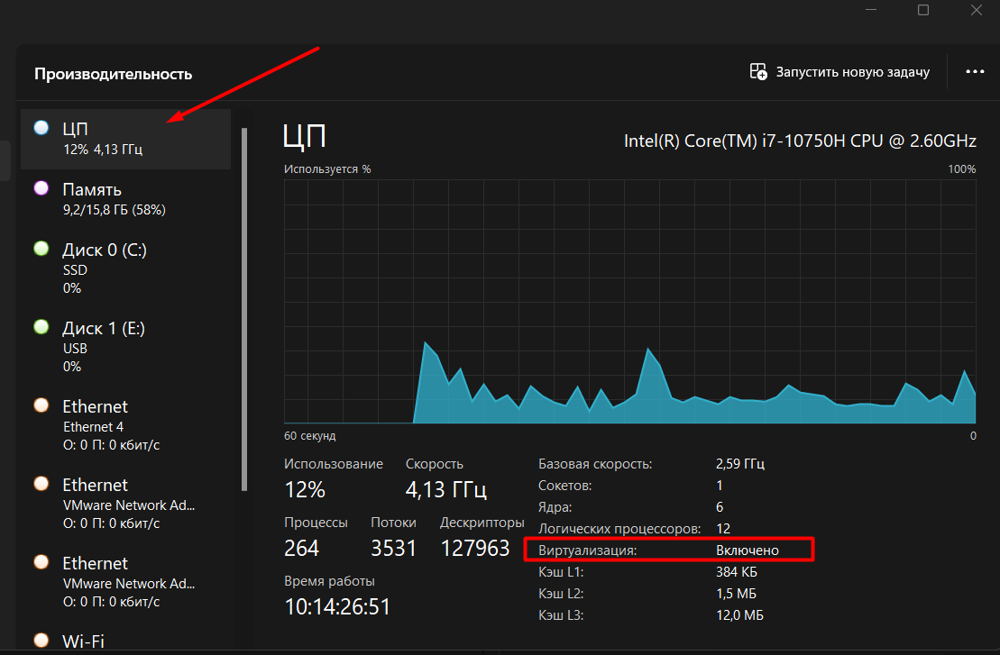

если виртуализация отключена, то её необходимо включить, в интернете полно инструкций как это сделать

## Что ждёт на модуле

- Мы познакомимся с доменной структурой `Windows`

`Windows` широко используется не только на домашних компьютерах, но и в различных по величине организациях


> Как делал Иван Костомаха - можно пообщаться со студентами и обсудить у кого какая операционная система

На данный момент `Windows` очень сложно заменить другой операционной системой в организациях, она захватила большую часть рынка своим удобством и настройкой не только внутри организаций, но и на домашних устройствах

Знания которые мы будем получать на данных занятия будут актуальны многое количество лет, потому что на данный момент `Windows` заменить невозможно.

Мы познакомимся с:

- `Active Directory` - это служба каталогов, позволяет управлять сущностями внутри организации.
- поговорим о `DHCP` и `DNS`, а также настроим их
-  также поговорим как в `Windows` реализованы сертификаты безопасности и центр сертификаций
- рассмотрим многодоменную инфраструктуру и как ими управлять

## Установка

Инфраструктура будет у нас выглядеть так:

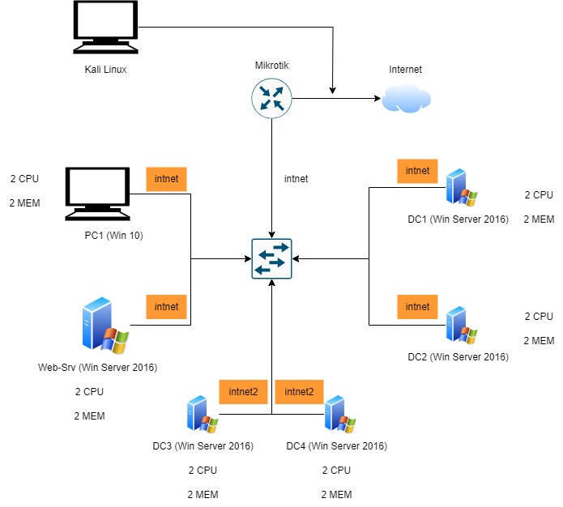


Мы с вами установим микротик, через него у нас будет выход в сеть и через него мы свяжем все наши виртуальные машины, указав один и тот же виртуальный адаптер внутренней сети. 

Также у нас в сети будет виртуальная машина с Windows 10, домен контроллер (`DC1`), на котором будет стоять Windows Server 2016, а также ещё один домен контроллер (`DC2`), она у нас будет первоначальная. 

Потом у вас будет задача по развороту ещё двух виртуальных машин (`DC3` и `DC4`) с ОС Windows Server 2016

Ну и также нам понадобится сервер `IIS`.

Конечно все эти виртуальные машины не обязательно держать включёнными, максимум на каждом занятии нам понадобится 2-3 включенных виртуальных машины, не считая microtik

Микротик у нас будет просто роутером для выхода в интернет

Ну ещё нам понадобится Kali Linux, но для параллельных задач и проверки взаимодействий, но активного использования не планируется.

> Можно задать вопрос насчёт  схемы, всё ли понятно

На каждую из виртуалок, кроме микротика нам понадобится 2 ядра и 2гб оперативы
### Windows 10
Приступим к установке, открываем `VirtualBox`

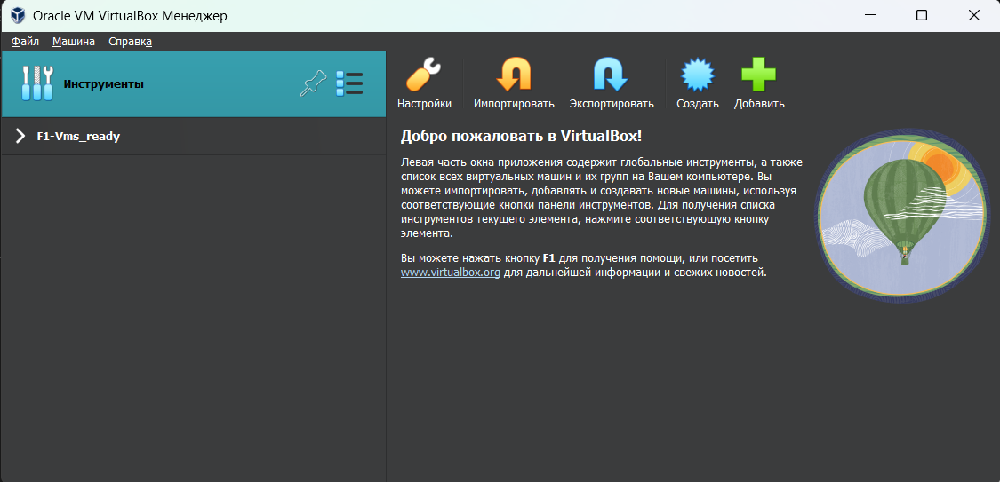


Нажимаем создать

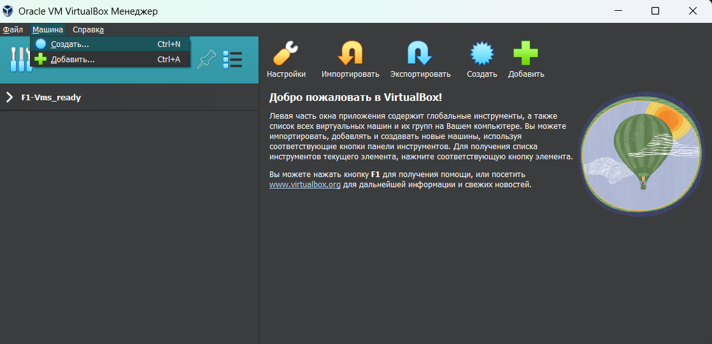

> тут же можно рассказать о других кнопках `добавить`, `импортировать` если кто-то хочет чтобы ему напомнили или он не знает

> можно также рассказать о самих виртуальных машинах, структуре папки, показать конфиг виртуалок (`.vbox` файл, а также о диске `.vdi` файле)

Вернёмся к установке.

Начнём мы с `Windows 10`, выбираем куда сохранить нашу виртуальную машину, выбираем образ `ISO` файл с `Windows 10` и нажимаем галочку "Пропустить автоматическую установку"

При выборе `ISO` образа `Virtual Box` сам выставит тип и версию ОС.

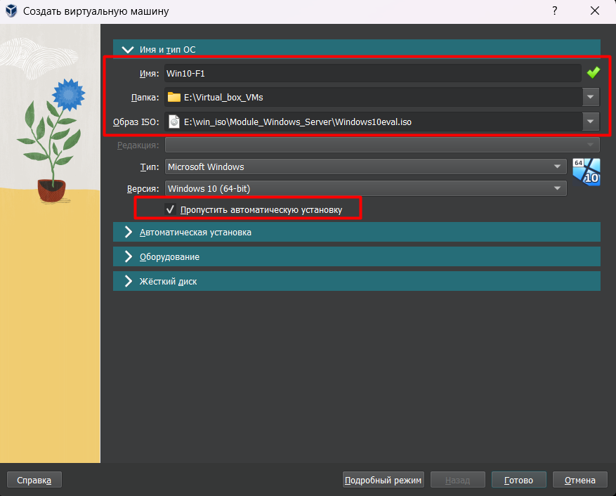

Во вкладке `Оборудование` выбираем 2ЦП

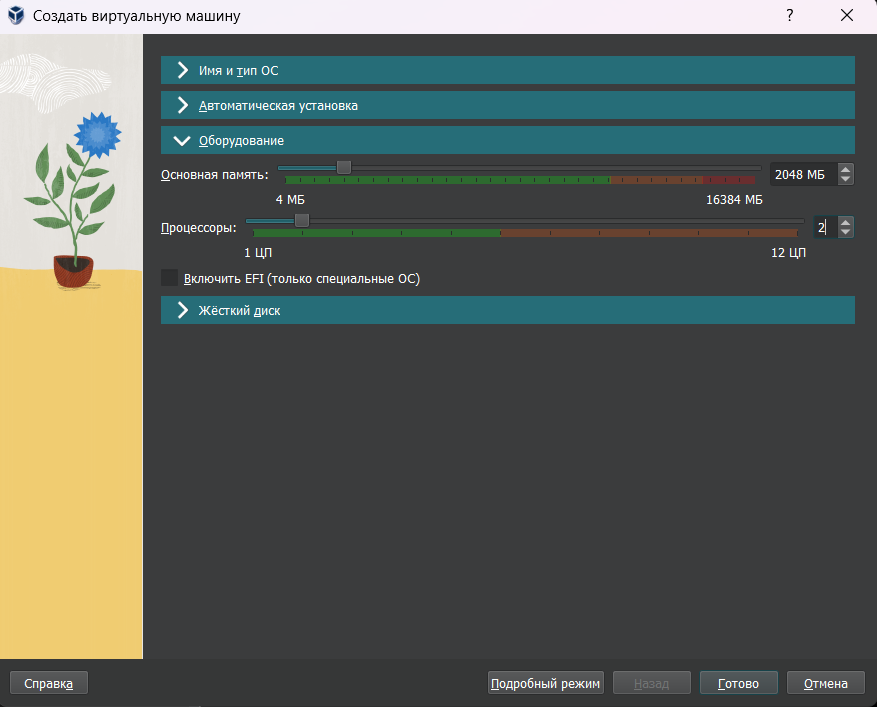

Далее переходим к опции жётского диска

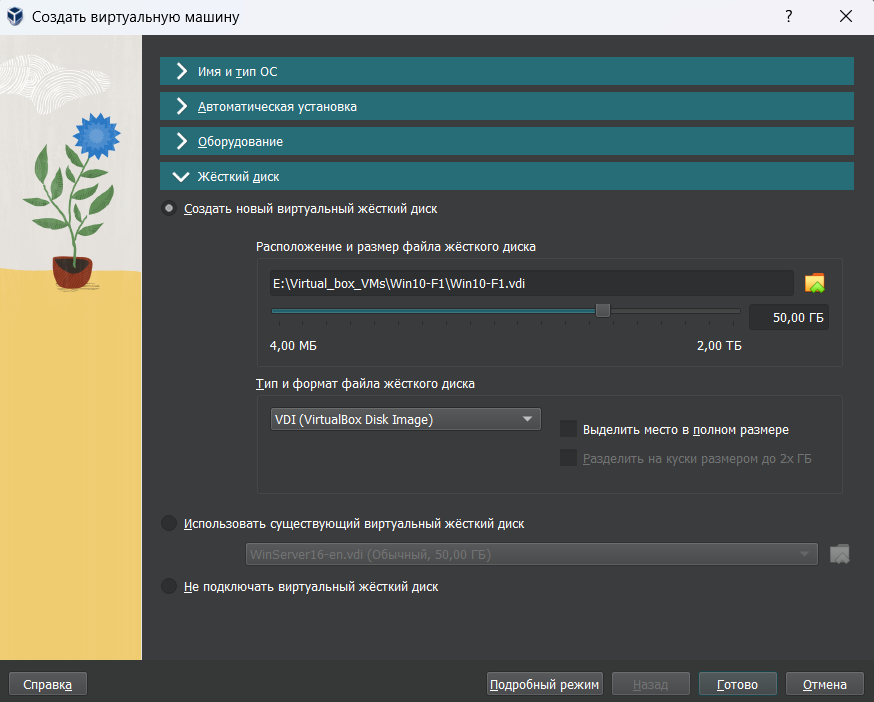

Тут есть несколько вариантов создания жётского диска:
- первый вариант по умолчанию - мы выделяем не всё место, а записываем значение в конфигурационный файл, после этого будет создан `.vdi` файл, у которого максимальное значение будет 50гб, при этом сама виртуальная машина будет считать, что внутри диск 50гб
- другой вариант - выделить все 50гб жёсткого диска сразу, нажав галочку "выделить место в полном размере", нам это не пригодится

Нажимаем "готово" и у нас есть виртуальная машина готовая к запуску

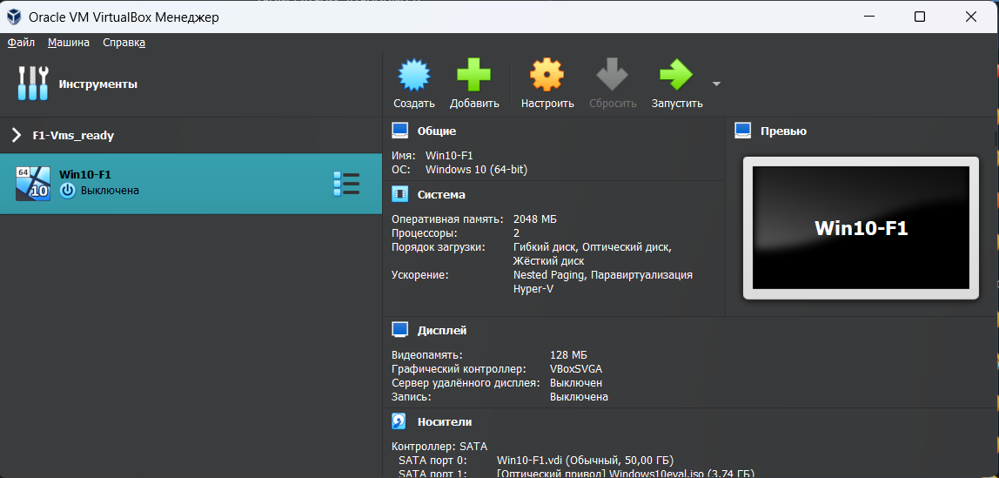

Заходим в настройки, переходим во вкладку "Сеть" и выбираем тип подключения "Внутренняя сеть"

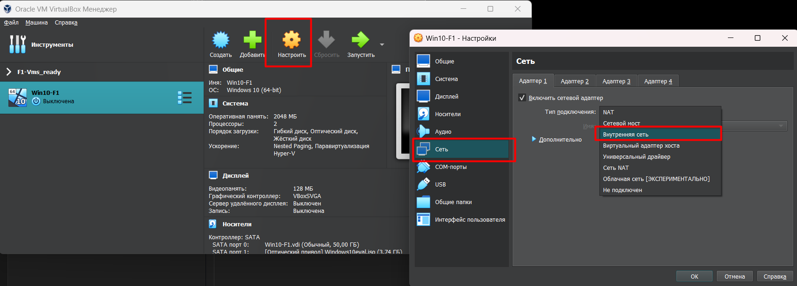

Нажимаем "Ок"

Нажимаем кнопку "Запустить"

Образ мы выбрали на этапе настройки, поэтому у нас сразу откроется установка `Windows 10`

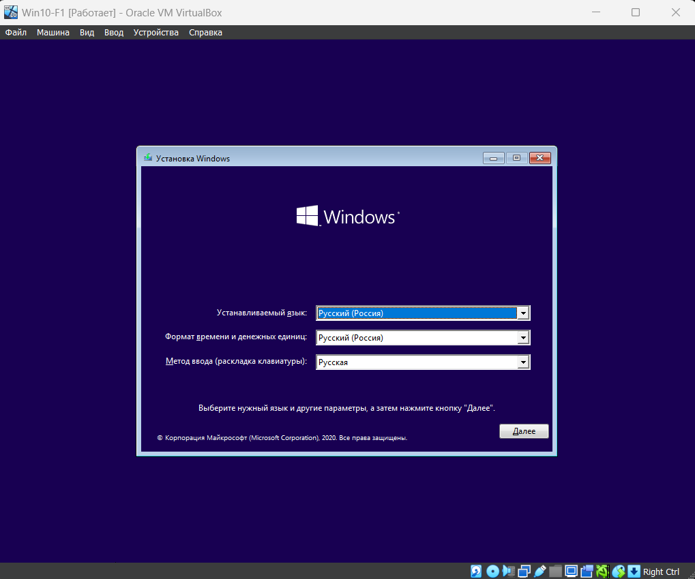

По сути сейчас везде можно нажать "далее" и закончить установку, но мы пройдёмся по всем пунктам:

- языки - образ поставляется с одним или нескольким языком, можно выбрать какой удобней, после установки язык можно сменить
- восстановление системы - с помощью диска или образа винды можно проверить виндовс на ошибки, восстановить недостающие файлы, откатить с помощью бэкапа, удалить обновления или вызвать командную строку

Нажимаем установить

Нам предлагают ввести ввести ключ продукта, но мы нажимаем "У меня нет ключа продукта"
Windows обладает пробным периодом, в течении которого можно ввести лицензионный ключ продукта

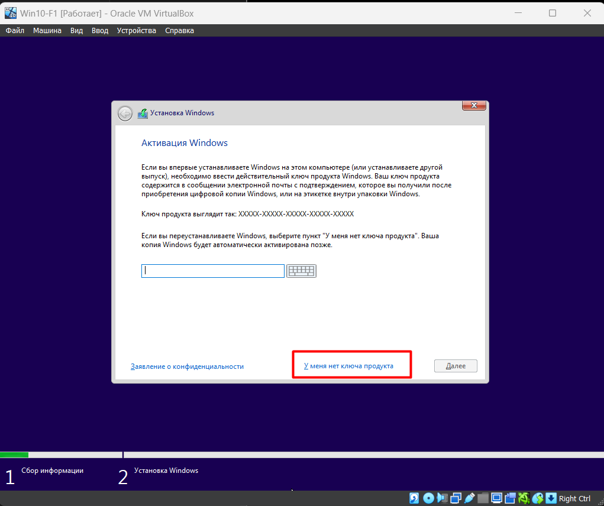

Далее необходимо выбрать версию, мы выбираем "Pro" версию, так как её можно вводить в домен, домашнюю версию нельзя ввести в домен

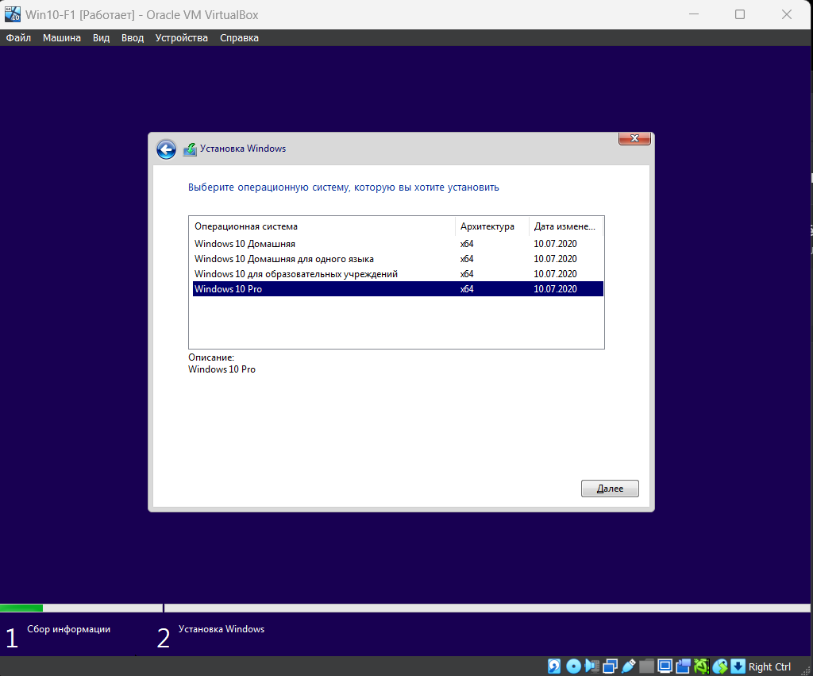

Принимаем лицензионное соглашение и нажимаем "Далее"

Далее будет выбор типа установки, мы выбираем "Выборочная", потому что обновление Windows нам не нужно, так как у нас нет версии Windows на текущей виртаульной машине

Далее предлагается выбрать где установить Windows, мы жмём далее, так как у нас один диск и нам нет смысла его делить, так как параллельно другие системы

> можно отвлечься и рассказать про разделы диска, как их создавать, но я не буду об этом говорить

И всё, происходит установка Windows 10
### Windows Server
Пока происходит установка Windows 10 мы приступим к установке 

Установка происходим также как и установка Windows 10, но есть пара нюансов

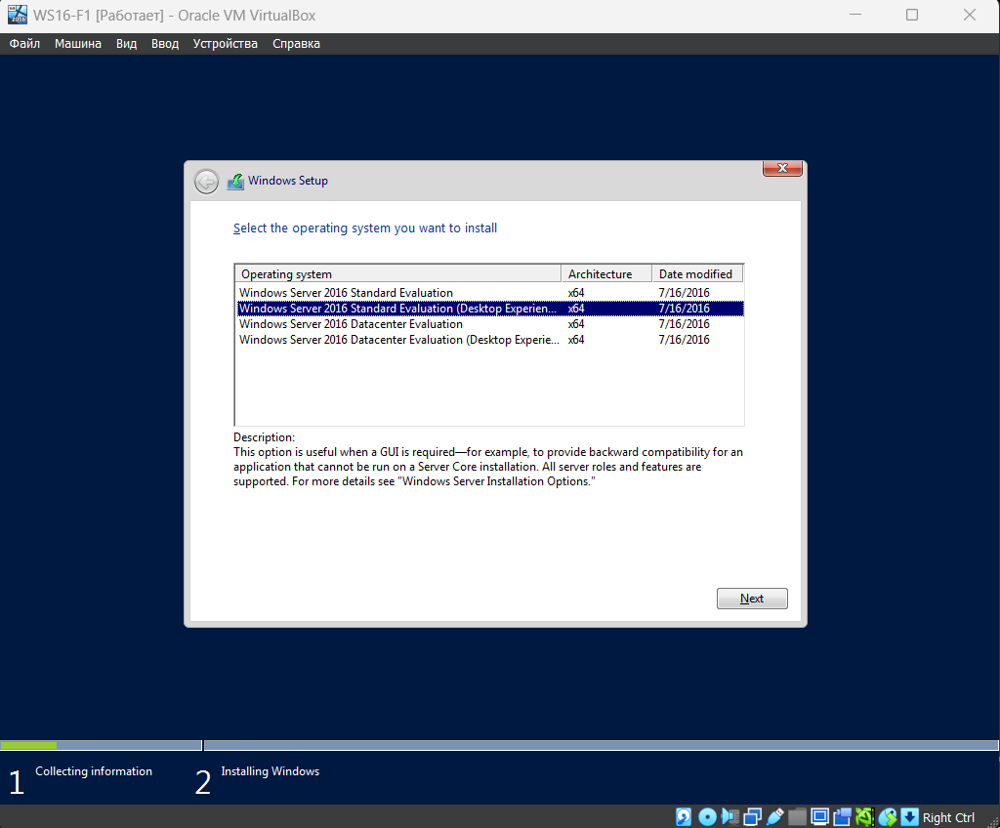

У нас есть два выбора лицензирования:

- стандартное лицензирование
- датацентр лицензирование

Датацентр лицензирование ничем в плане компонентов не отличается от стандартного лицензирования, дело только в лицензировании

Датацентр лицензирование нужно чтобы лицензировать вложенные виртуальные машины в неограниченном количестве, для примера на Windows Server можно поставить роль Hyper-V, и Hyper-V будет виртуализировать виртуальные машины, в стандартной лицензии можно лицензировать максимум 2 виртуальные машины, в датацентр лицензировании можно в неограниченом количестве

Нам это не пригодится в рамках нашего курса, поэтому вы выберем стандартное лицензирование, но тут тоже есть различия:

- первая - это консольный сервер, без графической оболочки, с ней мы познакомимся позже
- второй - версия с графическим интерфейсом, она нам сейчас и нужна

Нажимаем next->next->next и начинаем установку Windwos Server

### Microtik

Приступим к настройке микротика

Микротик у нас скачать в формате `.ova` - это подготовленный для развёртки образ виртуальной машины

Чтобы ипортировать его, мы должны выбрать `Файл` -> `Импорт конфигураций`

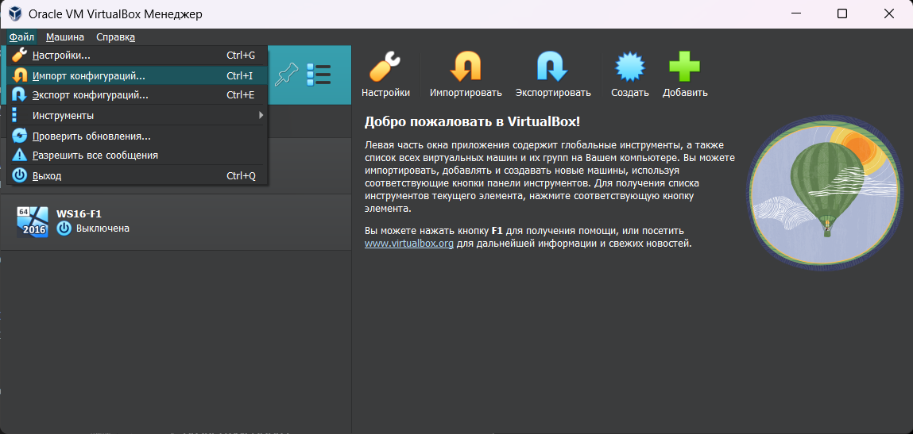


Выбираем `.ova` образ в опциях импорта конфигураций

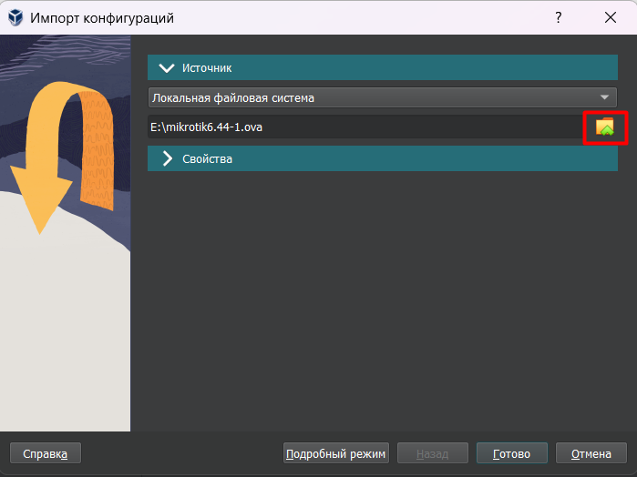

И нажимаем "Готово"

> тут можно рассказать о дополнительных окошках что там можно посмотреть или поменять (опионально)

Мы при подготовке к занятию скачивали WinBox, она нам пригодится для взаидействие с microtik

Запускаем microtik, когда вы увидите строку ввода логина это значит микротик запустился

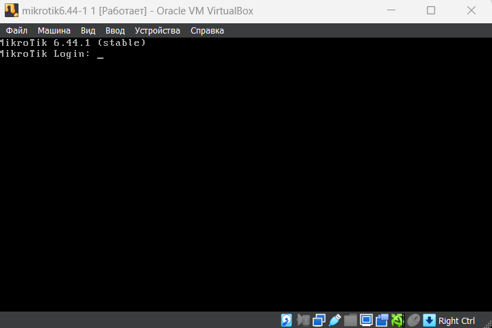

Логин: `admin` \
Пароль пустой

Теперь открываем WinBox

Переходим в раздел `Neighbors`

Вы там увидите адаптер с IP адресом `0.0.0.0`

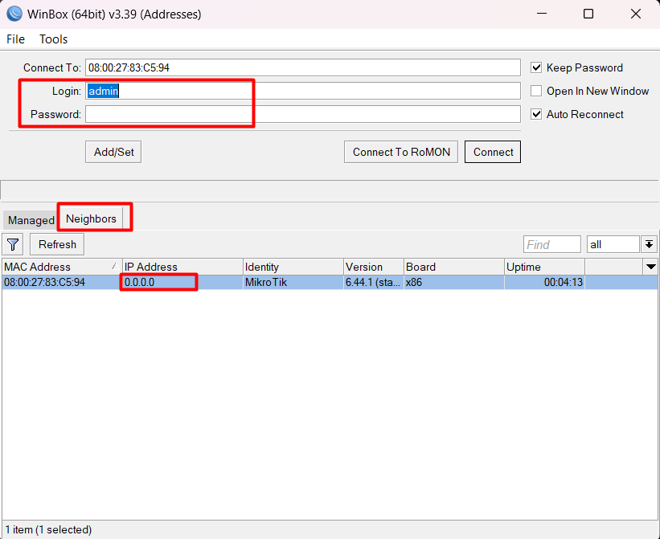

Вводим логин и нажимаем `Connect`

У нас открывается окошко настройки микротика

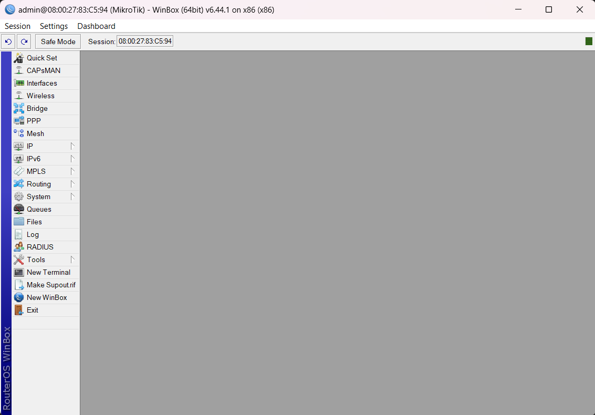


Тут много параметров, но нам нужно всего несколько

Открываем раздел `Interfaces`, там будет три адаптера, стандартно они будут называться:
- ether5 - соответствует первому адаптеру виртуальной машины, т.е. NAT 
- ether6 - соответствует второму адаптеру - внутренняя сеть
- ether7 - адаптер через который мы взаимодействуем прямо сейчас

Первые два адаптера нам как раз и надо настроить

Нажимаем два раза по адаптеру и для удобства можем сменить имя и что самое главное, нам нужно нажать кнопку `Reset MAC Address` -> `Apply` -> `Ok` \
**Это нужно сделать для двух адаптеров**

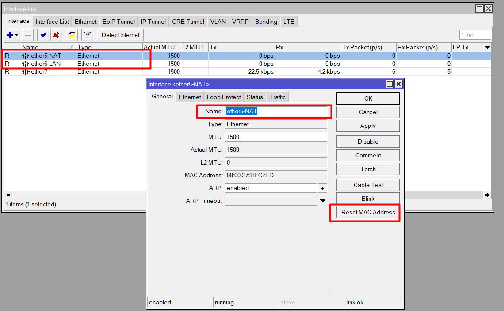


Микротик будет нашим гейтвеем

Далее переходим в `IP` -> `Adresses`

Нажимаем на "+" и заполняем данные:
```
192.168.10.254/24
192.168.10.0
ether6-LAN
```

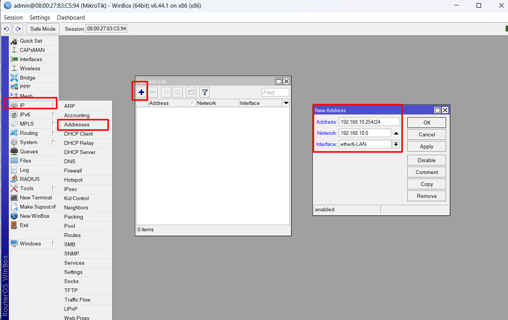

Жмём `Apply` и `OK`

Это будет адрес гейтвея, адрес на LAN адаптере, главное их не перепутать

Далее переходим во вкладку `IP` -> `DHCP Client`

Мы видим красную строчку, два раза нажимаем на неё и нажимаем `Apply` -> `OK`, больше никаких действий не требуется

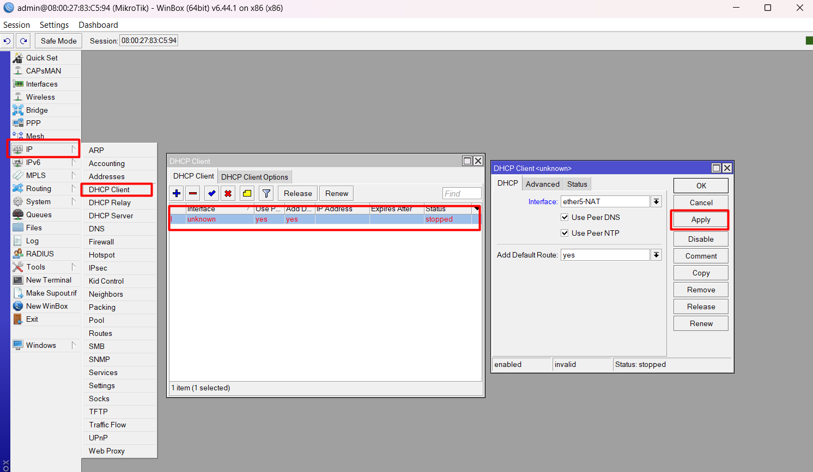

Теперь переходим в `IP` -> `Firewall`, нам нужно настроить правило для натинга 

Переходим во вкладку NAT и нажимаем на "+"

Выбираем `Out.Interface` - `ether5-NAT`

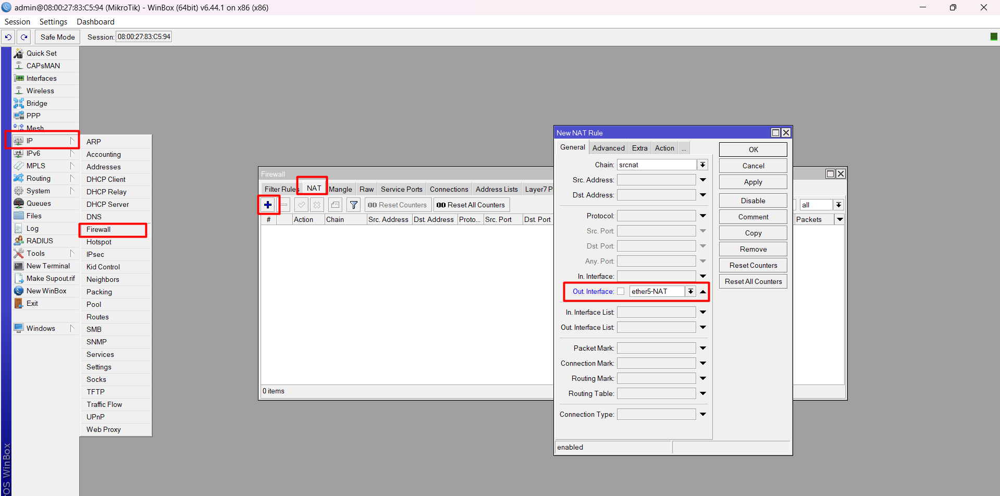

В этих же настройках переходим во вкладку `Action` и в графе `Action` выбираем `masquerade`, нажимаем `Apply` и `OK`

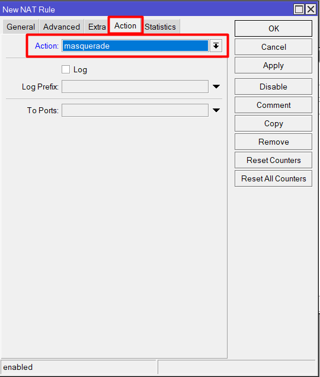

Всё, на этом настройка microtik закончена


## Настройка

### Windows Server

Открываем наш Windows Server, нас приветствует экран, где мы должны будем создать пароль для Администратора, по умолчанию в винде присутствует парольная политика:
- не менее 7 символов
- цифра
- буква в верхнем регистре
- буква в нижнем регистре

**Мы будем использовать простой пароль - `Qq123456`**

Нажимаешь `Finish` и теперь можно зайти в систему

При входе в систему у нас запускается окошко - `Server Manager`, он нам позволяет очень удобно управлять сервером

> Можно рассказать что есть что в этом сервер менеджере

> Далее надо рассказывать как мы ставим Guest Additions

Подготовка Windows Server завершена

### Windows 10

Первоначальная настройка, выбираем язык, часовой пояс, раскладку

Далее когда предлагают подключить к сети, слева внизу выбираем "у меня нет интернета", потом также слева нажимаем "продолжить ограниченную установку"

Вводим имя пользователя, у нас он будет - `user` и когда попросят сделать пароль мы нажимем `Далее`

После мы отключаем все параметры возможности -> `Принять` и потом нажимаем `Нет`

И начинается настройка профиля

## Завершение

Как домашнее задание у вас будет установить русскую версию Windows Server 2016 