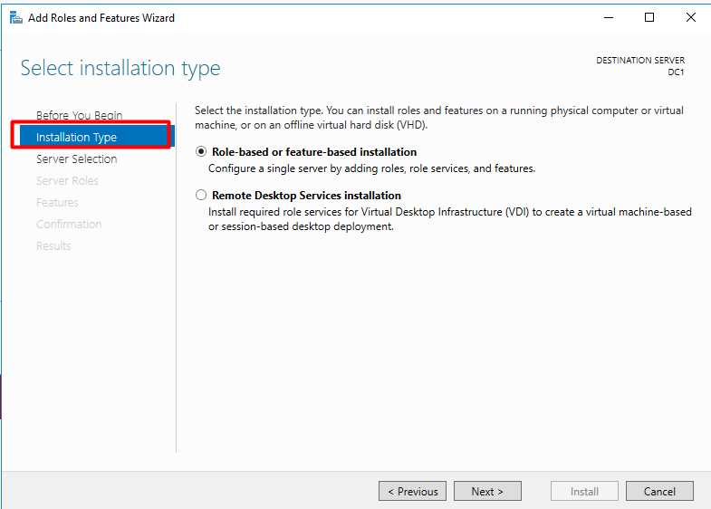

# Speech 2

## Содержание для быстрого доступа к участкам спича

- [Предисловие](#предисловие)
- [Начало](#начало)
    - [4 слайд](#4-слайд)
    - [5 слайд](#5-слайд)
    - [6,7 слайд](#67-слайд)
    - [9 слайд](#9-слайд)
    - [10 слайд](#10-слайд)
    - [11 слайд](#11-слайд)
    - [12 слайд](#12-слайд)
- [Настройка IP, часового пояса и имени компьютера](#настройка-ip-часового-пояса-и-имени-компьютера)
    - [Windows Server](#windows-server)
    - [Windows 10](#windows-10)
- [Создание домена](#создание-домена)
    - [Windows Server](#windows-server-1)
    - [4 слайд](#4-d181d0bbd0b0d0b9d0b4-1)
    - [5 слайд](#5-d181d0bbd0b0d0b9d0b4-1)
    - [6 слайд](#6-слайд)
    - [7 слайд](#7-слайд)
    - [8 слайд](#8-слайд)
    - [9 слайд](#9-d181d0bbd0b0d0b9d0b4-1)
    - [10 слайд](#10-d181d0bbd0b0d0b9d0b4-1)
- [Настройка домена после установки компонентов](#настройка-домена-после-установки-компонентов)
- [Завершение](#завершение)


## Предисловие
> спросить у студентов как они справились с домашним заданием

У нас было подготовительное занятие, где мы устанавливали Windows 10 и Windows Server, а также настроили microtik

## Начало

Поговорим немного о Windows

Если вдаваться в историю:

> тут нужно идти по слайдам презентации 1.1

### 4 слайд

В 80-е появляется первый графический интерфейс MacOS. В это время у Microsoft был MS-DOS - консольная операционная система, они через короткий промежуток времени делают графический интерфейс для своей ОС, который просто устанавливается поверх MS-DOS, но это всё ещё остаётся MS-DOS. Особенность заключалась в том, что была возможность переключаться между окнами и различными компонентами, в отличии от MacOS. 

В 1993 года создаётся выпускается Windows NT 3.1 - отдельная от MS-DOS система со своим ядром, сначала появляется версия для юзеров, а потому появляется версия `Advanced Server` для того, чтобы администраторам было проще управлять компьюетрами. К 2000 году появляется `Windows Server` на новой арххитектуре, это обусловлено переходом на новое поколение ядра Windows. C этой же версией начинает развиваться доменные сервисы. Windows завоевала свою популярность из-за того, что предоставляла очень удобный интерфейс своим пользователям при переходе людей которые работали в офисе на людей которые работали в офисе с компьютерами. 

> В конце можно добавить что это отождествлялось с реальностью: документы, файлы, папки и даже корзина

[История Windows](https://ru.wikipedia.org/wiki/Windows#%D0%93%D1%80%D0%B0%D1%84%D0%B8%D1%87%D0%B5%D1%81%D0%BA%D0%B8%D0%B5_%D0%B8%D0%BD%D1%82%D0%B5%D1%80%D1%84%D0%B5%D0%B9%D1%81%D1%8B_%D0%B8_%D1%80%D0%B0%D1%81%D1%88%D0%B8%D1%80%D0%B5%D0%BD%D0%B8%D1%8F_%D0%B4%D0%BB%D1%8F_DOS)

[История Windows NT](https://ru.wikipedia.org/wiki/Windows_NT)

Microsoft Windows очень сильно шагнула в корпоративный бизнес и завоевала его, они сделали систему очень масштабируемой.

### 5 слайд

Тут есть важные вещи, которые можно выделить:
- `Server Core` - версия без графики, более производительна из-за того, что убрали некоторые функции 
- `Server Manager` - оснастка, которая позволяет удобно настроить сервер
- `Data Duplication` - позвоялет оптиимизировать хранение данных в системе
- `Mobile Device Managment` - управление как минимум хранением почты на мобильных устроойствах
- `Huper-V` - виртуализация как esxi от VmWare

### 6,7 слайд

Большой разницы между Windows Server 2016,2019,2020 нет, в рамках нашего занятия разницы вообще не будет. 

### 9 слайд

Перейдём непосредственно к Windows Server, зачем это нужно и к концепции Windows инфраструктуры

Здесь есть три основные сущности:

- `Management` - идея состояла в том, чтобы создать каталог, в котором можно было вести учёт компьютеров, пользователей, серверов, а также удобно этим управлять и мастабировать
- `Workgroup` - это удобное управление компьютерами, находящихся в одной локальной сети, с помощью этой сущности можно шарить файлы, директории, а также устройства 
> для примера можно поделится принтером, который проводом подключен к вашему компьютеру с соседом, находящимся с вами в одной локальной сети, основная цель - упростить взаимодействие между компьютерами с ОС Windows в одной локальной сети
- `Domain` - это инфраструктура, объекты которой принадлежат домену

Когда мы создадим домен, нужно будет, чтобы его кто-то обслуживал.

### 10 слайд

Тут у Windows есть обычное клиент-сервер взаимодействие

- Сервер - домен контроллер
- Клиенты - наши компьютеры в домене

Домен контроллер - набор сервисов и программ, которые устанавливаются на Windows Server и позволяют ему стать контроллером домена, не каждый Windows Server является контроллером домена, для примера есть Windows сервера, на которых разворачивают сервера или размещают сайты.

### 11 слайд

Поговорим о сервисах

- `Active Directory` - это если простым языком сказать база данных, в ней хранятся объекты
- `DNS` - DNS сервер - сервер для разрешения имён (Resolve Names), важно уточнить, что `Active Directory` не работает без `DNS`, потому что практически всё в домене Windows представлено в виде доменных имён: имена ПК, пользователь, сервисы

### 12 слайд

Помимо всего этого у нас есть:

- `DHCP` - выдача IP адресов компьютерам и серверам
- `Group Policy` - групповые политики, позволяющие централизовано настраивать компьютеры или учётные записи пользователей, изменяя множество параметров
- `Global Catalog` - упрощённая база данных `Active Directory`, чтобы для примера быстро найти учётную запись или устройство

## Настройка IP, часового пояса и имени компьютера

Перейдём в процессу установки

### Windows Server

Запускаем английский Windows Sever (`WS16-F1`)

Мы подготовим наш Windows Server.

Переходим во вкладку `Local Server` и вы увидите основные настройки вашего Windows Server, увидите
-  `Computer name` - всегда будет случайный при установке Windows
- Параметры `Ethernet` - адрес которого на данный момент получен с помощью DHCP microtik 
- `Time zone` - часовой пояс, начнём с него


Нажимаем на часовой пояс и меняем его на ваш (UTC+3 Moscow)

Теперь поменяем IP адрес, нажимаем на него, видим наш адаптер, нажимаем на него правой кнопкой мыши и заходим в свойства (Properties)

Отключим IPv6, потому что в данном курсе он нам не пригодится, потом нажимаем на IPv4 и нажимаем Properties


Обратите внимание, что в поле `DNS` мы пока что ничего не вписываем, этим мы займёмся позже, нажимаем `OK` -> `OK`, закрываем окно с адаптером

Последний пункт перед перезагрузкой - поменяем `Computer Name`, нажимаем на название -> `Change` и задаём имя `dc1` и нажимаем `OK`


Нам предложат перезагрузиться, это мы и сделаем, чтобы изменения были применены.


### Windows 10

Теперь сделаем то же самое для Windows 10.

Заходим в панель управления -> Сеть интернет -> Центр управления сетями и общим доступом -> нажимаем Ethernet -> Свойства

Отключаем IPv6 и переходим в свойства, чтобы поставить статический адрес


Указываем IP адрес, гейтвей и самое главное - в этом случае мы указываем DNS сервер нашего будущего DNS и домен контроллера


Нажимаем `OK`


Далее сменим имя компьютера.

С панели управления выбираем "Система и безопасность" -> Система -> Изменить параметры -> Изменить

Меняем имя компьютера на `pc1`


Жмём `OK`, предложат перезагрузиться - перезагружаемся, чтобы применить изменения

Windows 10 нам пока больше не пригодиться

## Создание домена

### Windows Server

В Windows Server есть набор базовых компонентов, которые можно установить и называеся он "Роли и компоненты". "Роль" в контексте Windows означает выполнение какой-то глобальной задачи, например DNS или DHCP сервер, "Компоненты" это более мелкие программы, которые позволяют дополнить Windows Server, сейчас мы и будет устанавливать роли и компоненты в наш Windows Server

Переходим в "Roles and Features"


Стартовое окно нам говорит:

```
Убедитесь, что Администратор имеет сложный пароль, параметры сети и IP сконфигурированы и что установлены все последнии обновления безопасности Windows
```

Нажимаем `Next`



У нас есть две опции:

- установка ролей и компонентов для сервера - это нам и нужно
- установка сервисов удалённого рабочего стола

> можно рассказать зачем нужна вторая опция

Нажимаем `Next` и у нас будет ещё две опции


- выбрать сервер из сервер пула - тут можно выбрать определённый сервер, потому что в инфраструктуре может быть не один сервер и Windows Server может устанавливать и управлять другими серверами через свою приопритарный протокол 
- выбрать виртуальный диск - это также связано с виртуализированной инфраструктурой

Выбираем первую опцию и нам сервер, жмём `Next`


Тут нужно выбрать 3 роли

> рассказать вкратце о том, что добавляется при нажимании на роль

Далее у нас есть набор фич, их довольно-таки много и обо всех рассказывать нет времени, нажимаем `Next`

Далее нам объясняют что мы ставим `AD DS` и что он делает

Далее объясняется про DNS и DHCP, это всё можно пропустить нажав `Next`

В конце нам резюмируют что мы ставим, нажимаем `Install`

После установки ролей и компонентов нам нужно сконфигурировать службу каталогов, она же Active Directory

Вернёмся к презентации (презентация 2)

### 4 слайд

Домен контроллер - сервер, который будет управлять всем в плане каталогов, там мы будем настраивать учётные записи пользователей, редактировать их, управлять другими серварами и много чего ещё.

Также с помощью домен контроллера происходит вся авторизация, аутентификация, т.е. пользователи в домене, которые авторизируются на своём ПК будут авторизироваться с помощью домен контроллера

### 5 слайд

После установки компонентов, что мы выбрали во вкладке `Tools` у нас появятся дополнительные опции, которыми мы будем пользоваться

### 6 слайд

Расскажу о них детально:

- `AD Users & Computers` - оснастка, которая позволяет увидеть объекты пользователей и компьютеров в домене, все они будут располагаться в разных директорях
- `AD Administrative Center` - более современная и возможно для кого-то более удобная оснастка, чем ADUC, но мы ей пользоваться не будем, в рамках курса будем использовать ADUC 
- `AD Domains and Trusts` - у нас будет отдельное занятие по поводу этого, вкратце: это взаимодействие между другими доменами и учётными записями
- `AD Sites and Services` - сейчас мы пропустим это, так как я расскажу это на конкретном занятии
- `AD Powershell Modules` - это дополнительное расширения для Powershell, которые позволят управлять AD сервисами из Powershell

### 7 слайд

Перейдём к компонентам AD DS

Есть несколько типов компонентов: физические и логические.

- физические - это какие-то файлы, сервера, каталоги

> рассказать про физические пункты конкретно, вроде своими словами будет несложно

- логические - пользователи, компьютеры, форесты, организационные юниты, группы

> также думаю вкратце несложно будет рассказать про каждый из пунктов

### 8 слайд

Здесь показано одно из месть, где может находится файл базы данных `NTDS.dit`, этот файл защищён и просто так его скопировать нельзя, для этого есть специальные инструменты, с помощью которого это можно сделать - `ntdsutil`, `vss shadowcopy`

### 9 слайд

Пример с разными доменами

> тут можно рассказать пример домены в разных городах, но одной компании, и то что если один домен обратится к другому, то без глобального каталога это было бы очень долго

### 10 слайд

Логическая структура, тут как раз и показан лес (forest) и поддомены (Domain tree)


> спросить есть ли вопросы по повду презентации

> **после ответов на вопросы сделать перерыв 10 минут**

## Настройка домена после установки компонентов

Перейдём к нашему Windows Server

Когда завершится установка компонентов, вы увидите две ссылочки:

- `Promote this server to a domain controller`
- `Complete DHCP configuration`

Мы нажимаем `Promote this server to a domain controller`


У нас будет 3 пункта развёртки, мы выбираем `Add a new forest`, потому что у нас нет существующего домена и нет леса (forest)

Называем наш новый домен `cyber-ed.local`


Далее нам предлагают выбрать уровень функциональности леса и домена, это отвечает за функции и совместимость домена или леса с другими (допустим резервными доменами)

Мы оставляем всё как есть

`DSRM` пароль - используется для восстаовления базы данных `NTDS`, его вводить надо обязательно, но мы его использовать не будем

Дальше предлагается делегировать DNS - эта опция предлагает управление DNS сервером другому домену, у нас один домен, поэтому нам это выбирать не надо

Далее автоматически подставляется доменное имя NetBIOS

Дальше указываются пути до определённых файлов, здесь указывается по умолчанию, в настоящих установках не рекомендуется хранить эти файлы на одном диске или в стандартных директориях

- Database folder - там где будет располагаться файл базы данных
- Log files folder - там где будут хранится логи взаимодействия с базой данных
- SYSVOL folder - системное хранилище различных объектов, для примера это групповые политики, скрипты выполняемые на компьютерах пользователей, данная папка доступна на чтение с любого компьютера домена

Дальше резюмируют какие настройки были выбраны

Далее пройдёт предварительная проверка перед применением настроек

> можно рассказать про ворнинги которые появляются

Нажимаем `Install` и начинается установка всех параметров

> пока создаётся домен контроллер можно рассказать про скрипт и сказать чтобы он у всех был скачан


Теперь учётная запись администратора принадлежит домену `cyber-ed.local`

После входа в учётную запись и открытии `Server Manager` мы увидим как появились новые владки слева и добавились новые роли

Нажам на флажок мы увидим, что нужно закончить конфигурацию DHCP сервера, нажимаем, здесь просто завершить авторизацию сервера в домене, нажимаем `Next` -> `Commit` -> `Close`

Теперь нам нужен будет скрипт, переносим его с помощью DnD или скопировав в буфер обмена

> если не работает, то подключить сетевую папку

Прежде чем запустить скрипт давайте зайдём в `Tools` -> `Active Directory Users and Computers`

> Тут нужно рассказать про структуру, что там за папки и для примера рассказать какие учётные ззаписи для чего могут использоваться

Заходим в Powershell, переходим в нужную директорию со скриптом и запускаем скрипт 
```powershell
.\newadusergroups-cyber-ed.ps1
```

> спросить у всех ли получилось запустить скрипт
> если не получилось - `Set-ExecutionPolicy Bypass - Force` 

Теперь давайте введём Windows 10 в наш домен

Переходим туда, же где мы меняли имя компьютера

Вводим имя нашего домена, после нажатия на `OK` нужно будет ввести логин и пароль пользователя домена, мы используем учётную запись администратора


Давайте зайдём под пользователем `Olga`

Таким образом мы ввели домен компьютер и зашли в доменную учётную запись пользователя.

## Завершение

Домашним заданием у вас присоединить второй Windows Server как резервный контроллер домена, дайте ему ошибку `192.168.10.201` и назовите `DC2`