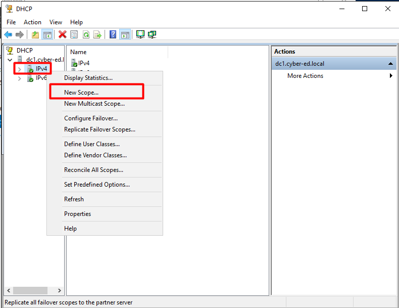
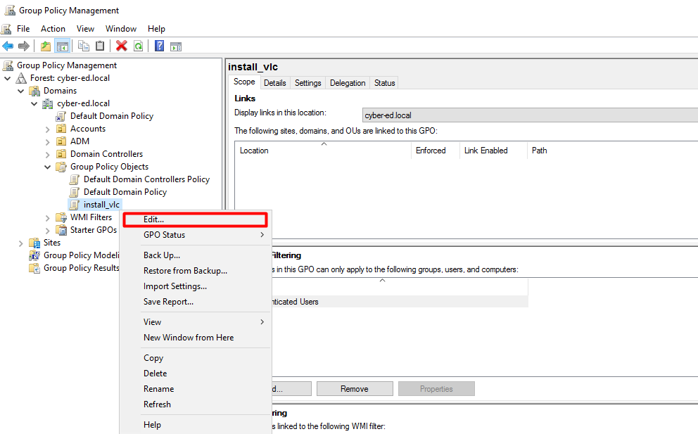
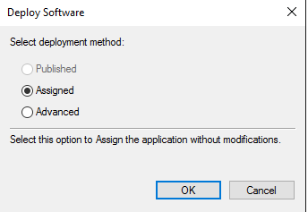

# 3 speech

## Содержание для быстрого доступа к участкам спича

- [Вступление - обсуждение домашнего задания](#вступление---обсуждение-домашнего-задания)
- [Начало - DNS](#начало---dns)
- [DHCP](#dhcp)
- [Групповые политики](#групповые-политики)
- [Практика - создание политики](#практика---создание-политики)

> спросить как дела, узнать как справились с домашним заданием

## Вступление - обсуждение домашнего задания

 На первом занятии я давал вам занятие установить русскую версию образа Windows Server, давайте зайдём в него, я ничего после установки и не делал, сейчас вместе с вами посмотрим как выполнялось домашнее задание, которое я дал вам на прошлом занятии.

 В самом начале мы должны проделать то же самое, что делали с первым домен контроллером, то есть:

 - сменить часовой пояс
 - сделать статический ip адрес
 - сменить имя

 Меняем ip адрес на `192.168.10.201`.

 А самое главное - адрес DNS сервера у нас будет `192.168.10.200` - адрес первого домен контроллера, потому что на нём мы настроили доменный DNS и с помощью него мы сможем ввести в домен наш второй контроллер

 

 После перезагрузки начинаем добавлять новые роли и компоненты

 Первые три пункта жмём `Далее` и во вкладке ролей сервера выбираем те же роли, что мы выбирали при создании домена контроллера `DC1`

 

 Доходим до установки компонентов, так как больше нам ничего не нужно.

 Итак, нажимаем "Повысить роль этого сервера до уровня контроллера домена"

 И тут мы должны выбрать первый пункт - "Добавить контроллер домена в существующий домен"

 

 Вводим наш домен и нажимаем "Выбрать", чтобы разрезолвить наш домен.

Нам предложат ввести учётные данные, для того чтобы ввести сервер в домен.

**Важно! Нам нужно указать учётные данные администратора другого домена, если вы просто введёте `Administrator:Qq123456`, то ничего не произойдёт, потому что поиск таких учётных данных происходит на вашем локальном сервере**

 

 Нажимаем далее до установки, более ничего более не нужно выбирать и завершаем установку.

 После перезагрузки также важно войти с помощью учётных данный `administrator`, не `Администратор`

 ## Начало - DNS

 Перейдём к DNS, так как на этой службе в доменной сети Windows завязано очень многое.

 Давайте разберём как работает DNS

 > рассказать про DNS, [пример статьи которую можно взять за пример](https://firstvds.ru/blog/what-is-dns)

 Мы будем настраивать внутренний DNS внутри нашей доменной сети

В оснастке у нас есть опция для настройки DNS


Пройдёмся по порядку:

- `Forward Lokup Zone` - зона прямого просмотра, т.е. мы пришли с доменным именем, нам выдали ip адрес
- `Reverse Lookup Zone` - зона обратного просмотра, означает что мы пришли с ip адресом, а выдали доменное имя

Посмотрим в `Forward Lokup Zone` -> `cyber-ed.local`, видим уже некоторые записи:


- `A` запись - сопоставление IPv4 адреса и имени
- `AAAA` запись IPv6 адреса и имени
- `MX` запись - специальная запись для определённого почтового сервиса
- `CNAME` запись - алиас, альтернативное имя записи
- `NS` запись - содержит Name сервера зоны
- `SOA` запись - конфигурация зоны

> можно рассказать про записи `SRV`, которые находятся в папка tcp/udp. Это записи, чтобы резолвить порты сервисов

> можно рассказать пару слов про `DCsync`, `AXFR` и `IXFR` запрос к DNS

 Что у нас будет с DNS по практике.

В `dc1` правой кнопкой нажимаем на `Properties`


Переходим во вкладку `Forwarders` -> `Edit` и вводим адрес нашего microtik

`Forwarders` - это сервера DNS к которым ходят за резолвом


Но DNS microtik не сможет разрезолвится, для этого нам нужно будет кое-что сделать.

Нам нужно поставить галочку в настройках `DNS` микротика -> `Allow remote requests`


С помощью nslookup можно определить не только адреса сайта (`A` или `AAAA` записи), но и DNS сервера, которые отдают эти записи

```bat
nslookup ya.ru
nslookup -q=ns ya.ru
```

Можно также узнать и другие записи, например `MX` запись

```bat
nslookup -q=mx ya.ru
```

И остальные записи можно также узнать.

Но можно узнать адрес у определённого сервера:

```bat
nslookup ya.ru ns1.yandex.ru
```

> Перерыв 10-15 минут

### DHCP


Прежде чем начать настраивать DHCP напомним что это такое.

`DHCP` - позволяет автоматически настраивать сетевые параметры для устройств - `IP`, `Gateway`, `Subnet mask`

Есть 4 шага у `DHCP`:

- `Discover` - широковещательный запрос на сеть, который запрашивает параметры
- `Offer` - предложение об аренде адреса, где сетевые параметры отправляются нам
- `Request` - подтверждение, что данный адрес мы готовы арендовать
- `ACK` - подтвеждение со стороны сервера, что адрес арендован

Есть также:

- `NAK` - запрос на повтор аренды с нуля
- `Release` - если компьютер хочет прекратить аренду адреса заранее
- `Inform` - сообщение с информацией о DHCP
- `Decline` - широковещательное сообщение об отказе, говорит о том, что IP уже занят

Жмём правой кнопкой мыши на `IPv4` -> `New Scope`



Нас встретит стандартный мастер по установке, жмём `Next`. 

Потом попросят ввести и описание для нашего нового пула.


Попросят ввести диапазон и автоматически подставится маска.


На этом наша настройках в принципе завершена, но я вам расскажу, что ещё тут есть.

Здесь также есть настройка исключений - исключения из диапазона некоторых адресов


Далее предлагают выбрать время аренды, мы можем поставить 10 минут или 8 дней.

Потом предлагают активировать настройки сейчас или сконфигурировать потом. Мы активируем это сразу, чтобы DHCP уже начал работать.

Далее предлагается уточнить дополнительные параметры, например адрес гейтвея. Вводим адрес нашего microtik и нажимаем `Add`


А также предлагается уточнить DNS, тут мы можем добавить новые DNS для резолва.

Например мы можем вбить сюда адрес нашего `dc2` и нажать `Resolve`, а потом `Add`


Следующая опция - `WINS` сервера - это протокол-надстройка над NetBIOS, Microsoft хотела сделать замену DNS, но идея провалилась

> в официальной документации Microsoft говорится о том, что если у вас уже есть DNS, то не стоит разворачивать WINS сервера - https://learn.microsoft.com/ru-ru/windows-server/networking/technologies/wins/wins-top

Ну и последняя опция - предлагают активировать Scope сейчас или потом, мы выберем, чтобы активировался он сейчас

Всё, теперь у нас есть пул адресов и настроенный DHCP сервер

Также есть настройка фильтров


Эта настройка позволяет разрешать или запрещать определённым MAC-адресам получать в аренду IP адреса.

В одной из практик у вас будет задание настроить отказоустойчивость DHCP сервера, если вы нажмёте правой кнопкой мыши по `IPv4`, то вы увидите настройку `Configure Failover`, где вы увидите пул адресов и адреса серверов-партнёров

Есть два режима работы:
- `master-slave` - когда один сервер работает, второй спит, как только первый перестаёт работать, то включается второй и начинает делать ту же самую работу
- разделение работы - в большой сети например можно сделать разделение на выдачу IP адресов, один сервер выдаёт одну часть, другой вторую.


### Групповые политики

Начнём с остнастки - переходим в `Tools` -> `Group Policy Management`


Мы здесь видим все наши `OU`, которые создавали ранее, на них можно применять групповые политики.

- `GPO` - если кратко, то это настройки

`GPO` содержит множество параметров, задевающие все аспекта домена, а также настроек компьютера пользователя. Например реестр, ПО, параметры пароля учётных данных и много-много всего, что можно настроить

Если мы откроем папку `Group Policy Objects` нашего домена, то мы увидим все политики


Сейчас у нас их две:

- `Default Domain Controllers Policy` - стандартная политика, которая применена на контроллеры домена
- `Default Domain Policy` - стандартная политика, которая применена на весь домен

Политика применяется на пользователей и на компьютеры.

Нажав два раза на политику во вкладке `Scope` мы увидим в опциях `Security Filtering` - это те, на кого применяется данная политика


Мы видим, что эту политику применяет любой объект или пользователь, аутентифицированный на компьютере. 

Если мы перейдём во вкладку `Details`, то получим детализиованную информацию о том, кто создал политику, в каком домене, UID и статус политики


Какие есть статусы политики:

- `Enabled` - полностью активированная политика
- `User configuration settings disabled` - работает только для компьютеров
- `Computer configuration settings disabled` - работает только для пользователей
- `All settings disabled` - полностью выключенная политика

Если мы перейдём во вкладку `Settings`, то увидим представление политики в графическом виде. Все политики хранятся в виде конфигурационных файлов

> здесь можно показать политику, которая лежит по пути `\\cyber-ed.local\SYSVOL\cyber-ed.local\Policies\{31B2F340-016D-11D2-945F-00C04FB984F9}\MACHINE\Microsoft\Windows NT\SecEdit\GptTmpl.inf` и сказать, что всё это во вкладке `Settings` в графическом виде

Далее вкладка `Delegation`, в которой рассказано у кого какие права управления политикой

И последняя вкладка - `Status`. здесь показано кто применяет эту политику (в нашем случае это dc1)

### Практика - создание политики

Домашним заданием у вас будет установка sysmon

А я вам покажу установку на примере другого софта.

Давайте для примера скачаем VLC - обычный плеер. Самая главная особенность - это скачать в формате `.msi`

- `MSI` - Microsoft Installer или по-другому - установщик, файлы формата `.msi` являются установочными файлами, которые позволяют устанавливать, а также удалять и контролировать версии ПО, сами файлы представляют собой некую базу объектов, которые устанвливаются в системе

Давайте скачаем vlc

> https://get.videolan.org/vlc/3.0.18/win32/vlc-3.0.18-win32.msi

И переместим его на наш `dc1`

Мы рассмотрим базовую политику связанную с распространением ПО

Переходим в `Tools` -> `Group Policy Management` -> наш домен

Для начала создадим саму политику, её мы создаём в папке `Group Policy Objects`


Теперь переходим к редактированию политики




Здесь мы видим два раздела:

- `Computer Configuration` - то что настраивается здесь применится только к компьютерам
- `User Configuration` - то что настраивается здесь применится только к пользователям

Так как в нашем случае мы устанавливаем софт, то его нужно всё-таки ставить для компьютеров


Тут у нас есть разные параметры:

- `Preferences` - тут что касается локальных настроек компьютера, тут можно поменять значения реестра, установить какие-то ярлыки, обновить переменные окружения, создать локальных пользователей и т.д.
- `Policies` - тут есть политики установки ПО, параметры безопасности, настройка исполняемых скриптов и т.д.

Нам в данном случае нужна политика установки ПО


Но прежде чем нам сделать политику нам нужно позаботиться о самом `.msi` пакете. Прежде всего он должен располагаться в сетевой папке с правами на чтение, чтобы каждый компьютер мог его взять и установить к себе, если он будет лежать в локальной папке, то политика по установке данного ПО просто не сможет выполнится

Давайте скопируем наш файл в сетевую папку `\\cyber-ed.local\SYSVOL\cyber-ed.local\software` 

> папку software надо создать

Далее указываем путь до нашего ПО на сетевой папке, после этого нас встретит окно, где будет три `Deploy` метода

- `Published` - публикация в списке распространяемого ПО
- `Assigned` - назначенное на установку ПО, оно нам и нужно
- `Advanced`



> тут можно пояснить за настройки (опционально)

Всё, политика готова

Но чтобы распространить эту политику на наш `pc1` нам нужно, чтобы он был в папках `OU`, а на данный момент он находится в папке-контейнере

Переходим в Переходим в `Tools` -> `Active Directory Users and Computers` и создаём новый `OU`


И переносим туда наш компьютер


Возвращаемся обратно, делаем `Refresh`, видим нашу новую `OU` папку, нажимаем правой кнопкой мыши и выбираем `Link a existing GPO...`


Выбираем нашу политику и жмём `OK`


Политика применяется только при определённых триггерах, тоесть сейчас она не работает:

- Если это политика для пользователя, то она применяется при логине или выходе пользователя из системы
- Если это политика для компьютера, то она применяется при включении или выключении компьютера

Но мы может "протолкнуть" политику на компьютере, для этого откроем `cmd.exe` от имени администратора, потому что политика компьютера видна только администратору

Вводим

```bat
gpupdate /force
```

После этого применятся политики и будет предложено перезагрузкить компьютер


После перезагрузки vlc будет установлен на компьютер.
