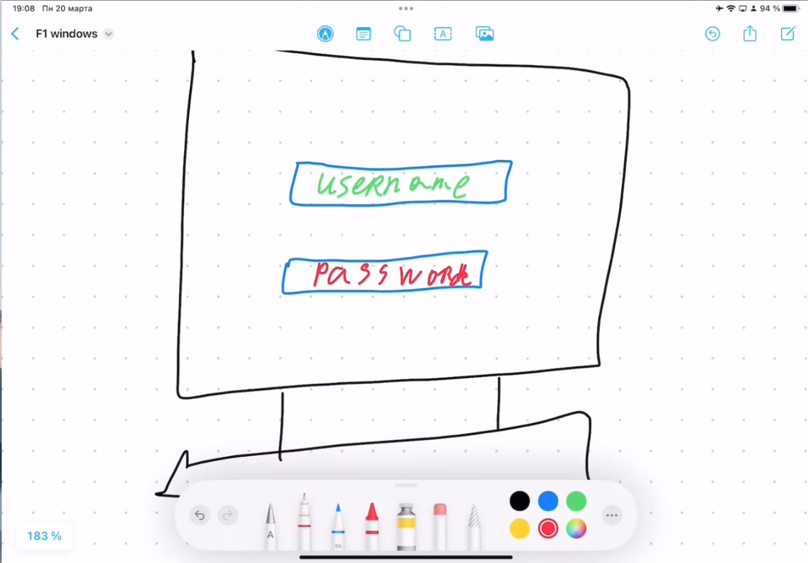

# Speech 4

У нас сегодня занятие, связанное с аутентификацией в домене Windows.

Все дело в том, что в домене очень удобная аутентификация как процесс, и это позволяет пользователям, в частности администраторам, жить проще.

Концепция заключается в конструкции Single Sign On (SSO) или единая точка входа - то есть одни ваши учетные данные предоставляют вам доступы ко всем сервисам, которые вам по правам положены.

И это не только базовые службы, но и любые другие, которые вы можете прикрутить к домену.

Очень большое количество софта в современном мире поддерживает аутентификацию на основе Active Directory, но тут я уточню, что AD как раз является удаленным сервером, который осуществляет аутентификацию пользователя. 

Давайте начнем с простого (открываю рисовалку) - вот у вас есть домашний PC:

1. вверху у нас будет username
2. а внизу у нас будет пароль

- А вот как работает аутентификация на самом деле?
- Куда аутентификационные данные отправляются?
- Кто их обрабатывает?
- Почему по итоге мы заходим на компьютер?

И вот сегодня об этом речь и пойдет.

**Однако для начала мы рассмотрим базовый пример аутентификации в рамках компьютера (без серверов, без AD, без ничего) - продолжаю рисовать:**

Вот то, что мы сейчас видим с вами на экране (страничка аутентификации при входе в компьютер; процесс, который показывает окошки входа) - это процесс Winlogon.exe

Winlogon.exe принимает в себя в качестве аргументов username и пароль и передает в следующий процесс, который выполняется в оперативной память (lsass).

Когда мы вводим логин и пароль на компьютере, то самое первое, что идет в память компьютера - это как раз имя пользователя.

Внутри ОС работает один очень нужный процесс - lsass.exe, который идет в БД учетных записей Windows SAM (Security Account Management) - это файл по пути C:\Windows\System32\config\SAM

И вот lsass приходит к SAM и говорит - ко мне пришел username, он у тебя есть в памяти?

Если пользователь не был найден, то пароль не проверяется.

Если пользователь был найден, то БД возвращает процессу lsass хэш пароля пользователя (далее рассказываю что такое хэш на примере md5 hash generator [https://www.md5hashgenerator.com/](https://www.md5hashgenerator.com/))

В Windows используется NT-хэш - это свой протокол NTLM, у него свой алгоритм и он по-своему преобразовывает пароль в хэш.

И вот далее lsass сопоставляет тот хэш, который он получил от SAM с тем, который был введен пользователем.

То есть пароль при вводе попадает в процесс lsass, по пути превращаясь в хэш.

lsass удаляет из памяти пароль в открытом виде, чтобы другие программы не могли его считать.

Далее хэши сравниваются. И если они верны, то генерируется сообщение lsass процессу Winlogon, что все прошло успешно.

Что будет, если мы убьем процесс lsass.exe в диспетчере задач? - нас просто выкинет из системы, после чего система перезагрузится, так как это жизненноважный процесс.

Почему так происходит? - в Windows есть концепция маркеров доступа (не буду вдаваться в подробности):

- то есть когда вы аутентифицировались в компьюетере, на самом деле ваш хэш остался в памяти lsass.exe, где присутсвует сопоставление хэша с username’ом. И вот когда вы запускаете какой-то процесс, осуществляете некий вызов, обращаетесь к принтеру или иному ресурсу, то вы не вводите пароль, так как за вас это делает lsass - он от вашего имени приходит к сервису и запрашивает выполнение с вашими привилегиями.
- поэтому когда вы завершаете процесс lsass, то вы не можете аутентифицироваться в рамках выполнения любой другой программы на хосте.

### Теперь давайте я покажу как происходит аутентификация в рамках Work Group.

У вас есть ваш компьютер - у него есть свой экземпляр SAM, но есть и другой компьютер в вашей сети и у него есть свой SAM, где SAM - это уникальная база для каждого из компьютеров.

И вот если вы по сети хотите придти к компьютеру № 2, например, на файловую шару, то вас просят ввести учетные данные.

На самом деле по началу на втором компьютере происходит попытка придти на него с вашими кредами, что хранятся в процессе lsass, но компьютер № 2 говорит, что у него своя БД пользователей, что нужны креды из его базы SAM.

То есть что происходит:

- когда вы приходите на другой компьютер, то первое, что может сделать ваш компьютер - это предъявить учетные данные вашей активной сессии пользователя (user@pc1).
- однако второй компьютер не знает пользователя из локальной БД SAM первого компьютера, поэтому эту аутентификацию он не пропускает.
- поэтому мы должны при аутентификации явно указать креды из БД SAM компьютера № 2 в формате user@pc2
- при этом данные пользователя user@pc2 попадут в память процесса lsass нашего компьютера № 1. Далее lsass пароль захэширует и отправит по сети для дальнейшей аутентификации
- а вот когда вы нажимаете кнопку сохранения учетных данных, то они сохраняются в реестре (там их можно найти, но только от лица Системы)

Конечно для пользователя это очень удобно, однако это удобно и для злоумышленника - мы можем запомнить данные и lsass будет автоматически их пробрасывать на компьютер № 2, и мы будем ходить к этому компьютеру некоторое время без аутентификации, постоянно предъявляя маркер доступа нашей УЗ user@pc2.

### **Однако у нас все-таки рассматривается доменная инфратсруктура и интересно как реализована аутентификация в рамках AD.**

На контроллерах домена файл SAM имеется, однако он не активен и не работает, так как все завязано на доменной аутентификации.

Аналог SAM, только доменный, а именно файл ntds.dit лежит по пути **C:\Windows\NTDS\ntds.dit**

**Теперь рисуем базовую аутентификацию в рамках домена. Зачем это вообще нужно.**

Вот у нас есть наш контроллер домена DC1 + есть компьютер PC1 (он часть нашего домена) + есть файловый сервер FS. И все в рамках нашего домена **cyber-ed.local**

Давайте начнем с аутентификации в рамках PC1:

1. мы вводим логин / пароль (процесс Winlogon.exe). Однако, как вы помните, если компьютер входит в домен, то домен автоматически подставляется при логине

1. После ввода кред процесс winlogon передает данные в процесс lsass, а вот lsass передает данные в процесс netlogon.

Процесс netlogon занимается тем, что умеет упаковывать данные для передачи по сети в рамках доменного взаимодействия (для передачи на DC).

1. То есть как в SAM’е - логин передается на DC и проверяется в базе ntds.dit ⇒ после чего осуществляется проверка учетных данных пользователя в плане хэша ⇒ после чего отправляется маркер для Winlogon, что креды верные.
2. Когда мы проводим такую аутентификацию мало того, что мы осуществляем аутентификацию - но и происходит проверка прав пользователя. То есть осуществляется проверка на членство в группах. На основе групп осуществляется применение политик, различные настройки прав доступа и так далее.

После того как пользователь зашел на компьютер, то креды у нас были сохранены.

**И тут пользователь захотел зайти на файловый сервер FS.**

А как же проходит данный вход? Тут тоже все зависит от протокола аутентификации.

Тут мы помним, что в процессе lsass креды пользователя закэшировались.

1. И вот если мы придем на FS с нашими закэшированными кредами, то FS это отклонит - он эту информацию передаст в сторону DC с запрослм есть ли у этого пользователя права доступа на чтение файлов из FS и вообще настоящий ли пользователь.
2. И вот DC говорит, что да, такой пользователь существует и у него есть права, но после DC скажет FS, чтобы тот посмотрел, а есть ли права у пользователя локально на FS на доступ к его файлам (DACL к объекту):

## Однако существуют определенные протоколы, которые позволяют аутентифицироваться по сети

### 1. Протокол LM (LAN Manager)

— это очень старый проткол, который в настоящее время не используется.

Какая суть протокола LM?

1. мы берем логин / пароль пользователя, после чего должны их отправить в сторону DC на аутентификацию.
2. сначала отправляем логин на аутентификацию, после пароль, захэшированным специальным образом:
    1. протокол LM поддерживает пароль не более 14 символов длиной. Если у вас в пароле 15 символов, то 15 символ будет отброшен и не обработан хэш-функцией.
    2. что делает LM? он делит пароль на 2 части, чтобы в каждой из частей было по 7 символов (если в пароле символов недостаточно, то LM просто на недостатющие позиции дописывает 0).
    3. и вот далее обе эти части хэшируются отдельным образом алгоритмом DES, причем предварительно все буквы возводятся в верхний регистр - то есть пароль регистро независимый.
    4. после чего 2 хэшированные части соединяются вместе, превращаясь в LM-хэш.
3. Всего может быть у алгоритма LM 2^92 паролей (можно сбросить за несколько часов).

### 2. Протокол NTLMv1 (LAN Manager с механизмом NT)

— алгоритм тоже сейчас не используется.

Какая суть протокола NTLMv1?

1. тут мы уже можем использовать пароль длиной в 128 символов, однако используется алгоритм хэширования MD4.
2. тоже легко брутится, так как тоже нет механизмов с солью в хэше + например, алгоритм не привязан на иных сущностях - таких как метка времени.

### 3. Протокол NTLMv2 (LAN Manager с механизмом NT)

Какая суть протокола NTLMv2?

1. тут используется алгоритм хэширования MD5 + также используется пароль длиной в 128 сиволов.
2. однако дополнительно придумали специальное взаимодействие для внесения некоторого рандомайза. То есть Microsoft придумали свой собственный апгрейд протокола *MD5 - HMAC-MD5*.
3. И как производится аутентификация?
    1. у нас есть 2 компьютера и DC;
    2. мы кидаем с PC1 в сторону DC username;
    3. DC находит что да, действительно такой пользователь присутсвует в БД и в ответ отправляет PC1 **запрос сервера** (рандомное число, которое генерирует сам DC);
    4. в ответ PC1 генерирует сначала NTLM-ответ:
        1. берется рандомное число от запроса сервера DC
        2. оно совмещается с меткой времени на PC1
        3. от этого совмещения берется хэш HMAC-MD5
        4. далее от полученного в предыдущем шаге хэша берется еще один хэш HMAC-MD5 с определенной фишкой - в качестве ключа для хэширования HMAC-MD5 берется хэш пароля пользователя
        5. на DC отправляется ответ NTLMv2 с полученным в пункте 4 хэшом, а также значение из пункта 3.
    
    
    
    1. после получения ответа NTLM DC производит ту же операцию.
        1. он берет время + совмещает с тем рандомным числом, который сгенерировал для PC1;
        2. берет от этого хэш HMAC-MD5;
        3. после чего берет от значения из 2 шага хэш HMAC-MD5 с ключом в виде пароля пользователя из БД ntds.dit;
        4. и если значения совпадают, то аутентификация успешно завершается;
        5. синхронизация по времени осуществляется с помощью NTP-сервера.

Однако если мы аутентифицируемся в рамках домена с помощью NTLMv2 на другом сервере (например, PC2), то все выглядит несколько иначе:

1. сначала PC1 делает запрос уже на PC2, а не на DC (отпарвляется username);
2. PC2 также отпарвляет PC1 рандомное число;
3. PC1 производит ту же операцию с меткой времени и рандомным числом и хэширует результат HMAC-MD5;
4. хэширует результат из пункта 3 алгоритмом HMAC-MD5 с использованием хэша пароля пользователя;
5. однако этот ответ NTLMv2 (пункт 4) вместе с захэшированной HMAC-MD5 совмещенной меткой времени и рандомным числом PC2 (пункт 3) ретранслируется с PC2 уже на DC, который как раз и осуществляет проверку на наличие пользователя в БД ntds.dit;
6. далее DC отсылает на PC2 ответ, что все ОК. Однако самое важное, что на DC осуществляется проверка прав доступа пользователя с PC1.

### 4. Протокол Kerberos

Протокол изначально создавался для недоверенных сред передачи данных, где каналы могут прослушиваться злоумышленниками.

Сейчас используется 5 версия Kerberos.

С протколом Kerberos в частности могут работать, например, Unix-системы.

Главное ньюанс, что у Kerberos осуществляется обоюдное подтверждение личности (то есть и клиент, и сервер подвтерждают себя). Например, NTLM не проверяет что DC является реальным контроллером домена.

Как работает Kerberos:

Наш компьютер PC1 желает получить доступ к ресурсу в рамках домена - файловому серверу FS. Однако предварительно PC1 должно взаимно аутентифицироваться с DC:

1. **(AS-REQ)** PC1 отправляет в сторону DC на AS (Authentication Server):
    1. username (UPN - User Principal Name);
    2. зашифрованную на основе хэша пароля пользователя, метку времени (timestamp)

1. **(AS-REP):**
    
    
    
    1. AS по нашему username делает запрос в ntds.dit, где ищет хэш пароля нашего пользователя;
    2. метка времени (не должна отставать больше чем на 5 минут от времени на KDC) расшифровывается хэшом пароля пользователя;
    3. однако помимо хэша пароля пользователя в память кладется хэш пароля сервисной УЗ KRBTGT.
    4. Далее необходимо сгенерировать ключ сессии - это ключ шифрования, который в дальнейшем будет передан на PC1 (начинает использоваться с **KRB-TGS-REQ)**. Данным ключом будут шифроваться данные при сетевом взаимодействии между DC и PC1. Ключ сессии шифруется хэшом пароля пользователя. Далее он передается на PC1:
    5. помимо ключа на PC1 передается TGT (Ticket granting ticket) - это универсальный ключ для нашего компьютера, который идентифицирует нас как личность. Что внутри TGT (TTL 10 часов):
        1. сессионный ключ + username (UPN) + метка времени DC (для отслеживания времени жизни TGT) ⇒ все это зашифровано хэшом пароля сервисной УЗ KRBTGT
    6. PC1 может получить сессионный ключ только при условии, если им был верно введен пароль, так как понадобится его хэш для расшифрования ключа сессии:

1. **(KRB-TGS-REQ)**:

Однако как нам теперь зайти на конкретный ресурс? В нашем случае это файловый сервер FS:

1. PC1 в открытом виде отправляет на KDC TGT и SPN сервиса, назначенный УЗ хоста FS. А также UPN + метку времени запроса ⇒ это все шифруется сессионным ключом.

1. (**KRB-TGS-REP)**:

1. KDC на DC из TGT билета для валидации достает:
    1. ключ сессии (которым впоследствии расшифрует UPN и метку времени запроса с PC1)
    2. username, по которому сможет определить права доступа, привилегии (его PAC - Privilege Attribution Certificate)
    3. SPN - для какого сервиса нужен TGS
2. KDC на DC генерирует TGS (Ticket Granting Service), зашифрованный хэшом пароля сервиса (машинной УЗ). Что внутри:
    1. username
    2. SPN
    3. PAC - Privilege Attribution Certificate
    4. метка времени создания TGS
    5. TTL TGS - в зависимости от настройки
    6. сессионый ключ между клиентом PC1 и сервисом FS (для шифрования данных между PC1 и FS) в открытом виде
3. TGS передается на клиент PC1 с сессионым ключом для связи между клиентом PC1 и сервисом FS, который зашифрован сессионным ключом, полученным на этапе **AS-REP.** 

1. **(AP-RES)**:

1. На файловый сервер FS отправляется (на скрине выше фигня):
    1. TGS в открытом виде
    2. UPN + метка времени ⇒ зашифрованные сессионным ключом, сгенерированным на шаге **KRB-TGS-REP**

1. **(AP-REP)**:

1. TGS расшифровывается хэшом пароля машинной УЗ файлового сервера FS;
2. Проверяется PAC для UPN для определения прав доступа для УЗ;
3. Валидируется метка времени;
4. Отправляется сообщение об успешном соединении.

### Но и протокол Kerberos не всегда безопасен

Существуют следующие атаки:

1. ***Golden Ticket (если злоумышленник получает TGT):***

Учетная запись KRBTGT – это специальная учетная запись в AD, которая подписывает все Kerberos-тикеты. Злоумышленники, получившие доступ к контроллеру домена (DC), могут использовать эту учетную запись для создания Golden ticket, который даст им неограниченный доступ к практически любой системе в корпоративной сети.

Атакующий создает TGT с использованием NTLM-хэша учетной записи krbtgt. Преимущества «золотого билета» в том, что он даёт возможность получения доступа к любому сервису или любому хосту внутри домена.

NTLM-хэш учетной записи krbtgt можно получить из процесса lsass, файла NTDS.dit или через атаку DCSync, но потребуются административные права, например, с помощью mimikatz.

1. ***Silver Ticket (если злоумышленник получает TGS):***

В отличие от Золотого билета, который предоставляет злоумышленнику неограниченный доступ к домену, Серебряный билет позволяет злоумышленнику только подделывать билеты службы выдачи билетов (TGS) для определенных служб. Билеты TGS шифруются хэшом пароля для сервиса, поэтому если злоумышленник украдет хэш для служебной учетной записи, то он может создать билеты TGS для этой службы.

Поскольку требуется только хэш пароля служебной учетной записи, его также значительно проще выполнить, чем атаку Golden Ticket. Такие методы, как сбор хэшей из LSASS.exe и Kerberoasting, являются распространенными способами, которыми злоумышленники получают хэши паролей учетных записей служб.

1. ***Bronze Bit (Tikcet) - CVE-2020-17049:***

Для выполнения этой атаки злоумышленнику нужны:

- хэш пароля сервисной учетной записи;
- этой учетной записи службы должно быть разрешено выполнять ограниченное делегирование другой службе:
    - это может быть классическое ограниченное делегирование
    - ограниченное делегирование на основе ресурсов

При выполнении этих предварительных требований злоумышленник может пройти аутентификацию во второй службе как любой пользователь. **Сюда входят члены группы «Защищенные пользователи» и любые другие пользователи, явно настроенные как «конфиденциальные и не подлежащие делегированию».** Второй сервис будет принимать и обрабатывать запросы злоумышленника, как если бы они исходили от олицетворенного пользователя.

Эта атака использует протоколы S4U2self и S4U2proxy, представленные Microsoft как расширения протокола Kerberos , используемого Active Directory. Атака использует протокол S4U2self для получения служебного билета для целевого пользователя к скомпрометированной службе с использованием хэша пароля службы.

Ссылка:

[CVE-2020-17049: Kerberos Bronze Bit Attack - Overview](https://www.netspi.com/blog/technical/network-penetration-testing/cve-2020-17049-kerberos-bronze-bit-overview/)

1. ***Kerberosting:***

Чтобы провести эту атаку, нужно получить доступ под обычным доменным пользователем, никакие привилегии не требуются.
Делается запрос к контроллеру домена на предмет доступных SPN (Service Principal Names). После получения этого списка, обратившись к служебной УЗ, можно запросить билет у контроллера, далее сохранить его себе, например, на диск и далее производить оффлайн брутфорс пароля служебной УЗ (то есть брутфорс TGS-тикета).

Также есть довольно глупая атака, и она зависит от администраторов, а не от особенностей работы протокола Kerberos - ***AS-REP Roasting***, то есть когда отключена преаутентификация:

Во время предварительной аутентификации пользователь вводит свой пароль, хэш которого будет использоваться для шифрования метки времени (timestamp), а затем контроллер домена попытается расшифровать ее и подтвердить, что был использован правильный пароль. Далее будет выдан TGT пользователю для использования в будущей аутентификации вместе с ключом сессии, зашифрованным хэшом пароля пользователя. Если предварительная проверка подлинности отключена, злоумышленник может запросить данные проверки подлинности для любого пользователя, и контроллер домена вернет зашифрованный TGT хэшом пароля сервисной УЗ KRBTGT, а также сессионный ключ, который может быть взломан в автономном режиме.

Данную атаку можно реализовать, например, с помощью **impacket** (набор эксплуатационных скриптов на Python).

### Захожу на Kali для демонстрации secretsdump (позволяет сдампить хэши паролей пользователей с удаленного DC):

Ссылка для инсталяции: https://github.com/fortra/impacket

Далее **cd impacket/example** ⇒ **python3 secretsdump.py ‘CYBER-ED/administrator@192.168.10.200’**

После чего должны выгрузиться хэши:

Теперь попробуем использовать **GetNPUsers.py (проверяет включена ли преаутнтификация у пользователей, можно использовать словарь)**:

**cd impacket/example** ⇒ **python3 GetNPUsers.py CYBER-ED/anton -request -no-pass -dc-ip 192.168.10.200**

С помщью crackmapexec можно предварительно в качестве разведки просканировать всю сеть на наличие хостов на DC по порту 445 SMB:

**crackmapexec  smb 192.168.10.0/24**

## Можно рассказать про аудит в Windows для детектирования атак

### Теперь давайте я покажу вам немного оснастки Windows:

Открываются они с помощью **mmc.exe (Microsoft Management Console - Диспетчер оснасток Windows):**

Далее Action ⇒ Add/Remove Snap-in..

Добавим следующие оснастки:

1. Certificates (Computer account);
2. Task Scheduler (Local);
3. Shared Folders (Local) 
4. Event Viewer (Local).

1. **Certificates** - тут находятся контейнеры для хранения сертификатов. Сертификаты используются для обеспечения защищенного доступа к определенным ресурсам (вместо пароля).
Сам сертификат может выписываться как на пользователя, так и на компьютер.
Сейчас мы с вами находимся в сертификатов компьютера и по умолчанию их у него нет - **Personal**.
Но есть **Trusted Root Certification Authorities ⇒ Certificates**. Это root-сертификаты, которым мы доверяем. **Тут мы видим некоторые сертификаты до 15 января 2038 года. Знаете почему?** Так как время в машинном представлении, то есть не так, как мы с вами его видим, отсчитывается, начиная с 1970 года (а это целочисленный параметр, под который выделено определенное количество бит - 32 бит, то есть 2^32 / 2 в секундах) - когда срок подступит, то время обнулится и снова станет как 1970 год.

1. **Task Scheduler** - с его помощью может заланировать самые разные задачи: выполнение скриптов, бэкапирование и многое другое.
2. **Shared Folders** - у вас на компьютере могут быть сетевые шары. Для нас очень важна шара C$.
На каждый компьютер в домене вы можете с помощью во вкладке Network в проводнике:
    1. \\<IP-address>\C$
    2. если вы являетесь доменным или локальным администратором, то, проходя аутентификацию, вы получаете доступ к диску C
    
    Скрипт **smbclient** спокойно может показать все сетевые шары на хосте:
    
    ****************************************************************************************************************smbclient -L 192.168.10.200 -U administrator@cyber-ed.local****************************************************************************************************************
    
    
    
    Чтобы зайти на шару:
    
    ****************************************************************************************************************smbclient ‘\\192.168.10.200\C$’ -U administrator@cyber-ed.local****************************************************************************************************************
    

1. **Event Viewer** - тут все просто, рассказываю все что хочу))))

### Атака Zerolon (CVE-2020-1472) - связана с недоработкой в криптографии протокола Netlogon Remote Protocol (MS-NRPC), он позволяет пользователям выполнить вход на серверы, использующие протокол сетевой аутентификации NTLM (NT LAN Manager).

Имеет CVSS с баллом 10.

Оригинальная атака Zerologon характерна тем, что механизм ее реализации заключается в сбросе пароля машинной учетной записи контроллера домена в Active Directory в значение пустой строки. Это позволяет злоумышленнику производить аутентификацию от имени машинной УЗ атакованного контроллера домена на других хостах в локальной сети. Так как машинная учетная запись DC имеет привилегии Администратора Домена, для злоумышленника после реализации атаки не будет ограничений в правах. Также злоумышленник получает доступ к хранилищу ключей аутентификации NTDS.dit, в которой находятся хеши паролей NTLM и ключи Kerberos. Эти ключи, в свою очередь, могут быть использованы, например, для выдачи себя за любого пользователя в домене или для создания поддельных билетов Kerberos в ходе реализации атак Golden и Silver Ticket.

Здесь точное описание эксплоита:

[https://github.com/VoidSec/CVE-2020-1472](https://github.com/VoidSec/CVE-2020-1472)

Перед реализацией необходимо предварительно сделать Snapshot вашего DC.

**python3 set_empty_pw.py DC1 192.168.10.200**

Тут мы сбросили пароль для машинной УЗ DC до пустой строки.

Далее в README мы нашли дальнейший вектор:

**secretsdump.py -hashes :31D6CFE0D16AE931B73C59D7E0C089C0 ‘cyber-ed/DC1$@192.168.10.200’**

— где **31D6CFE0D16AE931B73C59D7E0C089C0** - это хэш пустой строчки.

И вот мы сдампили хэши паролей пользователей.

Для разбора рекомендую видео (очень сложно объяснить криптографические тонкости и нет особой необходимости):

[https://www.youtube.com/watch?v=eJ6L8f6Sw_U&t=498s&ab_channel=TSARKAChannel](https://www.youtube.com/watch?v=eJ6L8f6Sw_U&t=498s&ab_channel=TSARKAChannel)

или:

[A different way of abusing Zerologon (CVE-2020-1472)](https://dirkjanm.io/a-different-way-of-abusing-zerologon/)

Можно в Event Viewer показать Event ID в System:

- EventID 5805
- EventID 5723

И:

- EventID 5805
- EventID 4624
- EventID 4742

