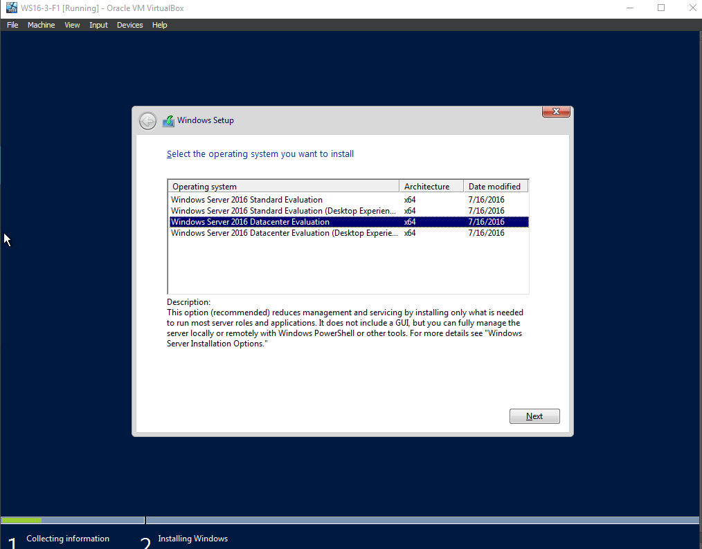
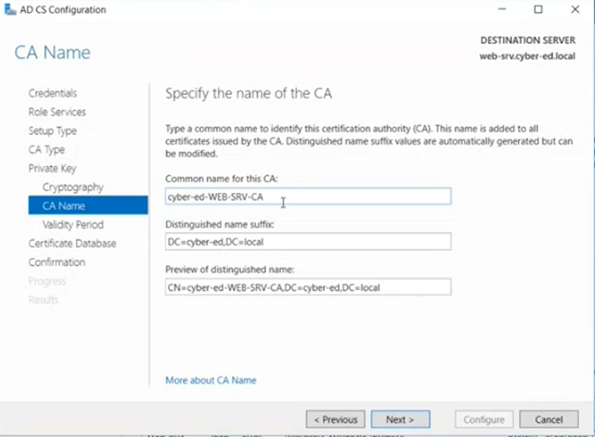

# Speech 5

*Данный список включает в себя список всех сервисов и их портов, используемых при взаимодействии Active Directory (на всякий случай):*

- *UDP порт 88 для Kerberos авторизации.*
- *UDP и TCP порт 135 для операций взаимодействия контроллер-контроллер и контроллер-клиент.*
- *TCP порт 139 и UDP 138 для File Replication Service между контроллерами домена.*
- *UDP порт 389 для LDAP запросов от клиента к серверу.*
- *TCP и UDP порт 445 для File Replication Service*
- *TCP и UDP порт464 для смены пароля Kerberos*
- *TCP порт 3268 и 3269 для доступа к Global Catalog от клиента к контроллеру.*
- *TCP и UDP порт 53 для DNS запросов*

Первую часть занятия мы с вами посвятим обмену данными в домене - file sharing с помощью DFS, а потом поговорим про сертификаты в рамках AD.

И начнем мы сразу с практики:

— запустите 3 сервер, который Core-версия + Mikrotik + DC1.

На примере консольного сервака (Core-сервер 3 WS16-3-F1) я покажу, что с консолью мы будем минимально общаться, потому что у Windows существуют очень удобные средства администрирования таких серверов.

Какая суть: консольный сервер меньше весит из-за отсутсвия GUI. И вот когда у вас запускается консоль CMD, то софт, который работает с CMD - он все же запускается в графике.

То есть тут есть большое отличие от консольного Linux, в котором нет X-сервера, который отвечает за всю графику в Linux - и тут вы графику запустить не сможете, только псевдографику (что видно в консольном терминале). 

Однако в Windows так можно - в core-версии отрубили графическую анимацию и приложение explorer.exe, который здесь и не нужен, но какая-то графика все-таки есть (можно убедиться, поставив VBox Utils):

В Windows Server 2016 все-таки нужно поработать с терминалом для ручной настройки некоторый конфигураций, однако в Window Server 2022 сделали приложение, которое в значительной степени упрощает жизнь администраторам и позволяет практически целиком исключить консоль даже в core-версии (там нажатием кнопок и галочками производится конфигурация).

Основная задача наша сейчас:

1. Назначить IP-адрес машине;
2. Дать ей имя;
3. Ввести в домен.

Сначала мы должны перейти в Powershell:

Вбиваем в CMD команду: **powershell**

Теперь в первую очередь назначим статический IP-адрес, предварительно отключив DHCP:

**Set-NetIPInterface -InterfaceAlias Ethernet -Dhcp Disabled**

Теперь отключаем IPv6:

**Set-NetAdapterBinding -InterfaceAlias Ethernet -Enabled:$false -ComponentID ms_tcpip6**

Задаем новый IP-адрес:

**New-NetIPAddress -InterfaceAlias Ethernet -IPAddress 192.168.10.100 -DefaultGateway 192.168.10.254 -PrefixLength 24**

Прежде чем ввести компьютер в домен, что мы предварительно должны сделать?

- задать имя;
- задать DNS.

Задаем DNS:

**Set-DnsClientServerAddress -InterfaceAlias Ethernet -ServerAddress 192.168.10.200 (IP-адрес DC1)**

Задаем новое имя (у нас этот сервак будет AD CS и Web-server):

**Rename-Computer -NewName web-srv**

Теперь перезагружаемся:

**shutdown.exe /r**

Также для перезапуска есть команда WMI в Powershell путем запроса объекта WMI **Win32_OperatingSystem:**

**(Get-WmiObject Win32_OperatingSystem -EnableAllPrivileges).Win32Shutdown(2)**

Теперь вводим машину в домен:

**netdom join web-srv /Domain:cyber-ed.local /Userd:admpetr /Passwordd:Qq12345   ⇒ shutdown.exe /r /f**

Видим что на DC у нас появился компьютер:

Теперь что я хочу продемонстрировать? Вот мы установили консольный сервак, но далее для администрирования мы его не трогаем, а работаем только через DC. То есть с помощью DC мы будем упарвлять другими серверами.

Теперь на DC мы идем в Server Manager в **All Servers ⇒ ПКМ ⇒ Add Servers**.

Теперь задаем имя web-srv (CN) ⇒ переносим вправо:

Далее ПКМ по web-srv ⇒ Add Roles and Features ⇒ Next ⇒ Next ⇒ в Server Selection выбираем конкретную тачку + Next ⇒ Server Roles: File and Storage Services **(DFS Namespaces и DFS Replication)** ⇒ Next:

В Features ничего дополнительно ставить не нужно (Next) ⇒ Install ⇒ Close:

Один нюанс: у нас установленны роли на web-srv , но нам нужно ими управлять. Мы можем это делать с помощью Powershell.

Поэтому мы можем установить графическую оснастку на DC1 (в идеале это должен быть отдельный сервер).

Соответсвенно теперь на DC1 мы должны добавить дополнительную оснастку. Повторяем пути как делали выше, только в Server Roles ничего не выбираем, а в Features выбираем **Remote Server Administration Tools (все оснастки для удаленного управления ролями) ⇒ Role Administration Tools ⇒ File Services Tools ⇒ DFS Management Tools**:

Далее Next ⇒ Install ⇒ Close:

После успешной установки DFS Management Tools отобразится в Tools. Переходим в DFS Management:

### Теперь давайте немного поговорим о теории

Используете ли вы какие-нибудь облачные хранилища типа Yandex или Google Cloud?

Предположим вы пользователь в домене (user@cyber-ed.local).

Вам дале ноутбук, вы на него зашли, администратор сказал какие программы вы можете поставить и храните на компьютере все ваши данные.

И в один прекрасный момент ваш компьютер ломается и у вас данных нет.

Однако администратор выдает вам новый ноутбук, вы авторизуетесь и на нем все ваши данные есть. Почему?

Настройки AD позволяют синхронизировать набор директорий из папок вашего пользователя. Как фактически это происходит?

— делается сервер (FS - File Storage), у него есть огромное дисковое хранилище, и настройки пользователя, все его файлы синхронизируются с этим сервером, когда пользователь находится в домене.

Данные пользователя с помощью протокола SMB копируются на сервер.

 

Однако компания большая и пользователей очень много, то один сервер не выдержит обслуживания их всех. Поэтому есть Prime-серверная ферма, состоящая из многих подобных серверов.

Однако вопрос: а если наш пользователь все синхронизировал на на FS1, то как новый компьютер поймет, что нужно прийти именно к FS1, а не FS2?

Microsoft придумали следующее: они оградили нас от знания конкретного DNS-имени каждого FS - они все называются /cyber-ed.local.

Это и называется DFS (Distributed File System). Как она работает?

Мы настраиваем хранения данных физически на различных серверах (у них своя репликация).

Мы располагаем в отдельной системе сервере DFS набор ссылок и говорим, что ресурс, например, бухгалтерии физически хранится на FS1 . Однако для всех пользователей ресурс бухгалтерии - это \\cyber-ed\buhgalteria.

Однако если наш FS1 ломается, то DFS сам обрабатывает это исключение и находит на каком из серверов хранится копия данных с FS1 (например, FS6) и перенаправляет все запросы на FS6.

Мы настроили 2 роли DFS:

1. DFS Namespaces (та штука, которая абстрагирует пользователя от прямых путей до файлов)
2. DFS Replication (позволяет осуществлять репликацию между FS)

### Теперь приступаем к конфигурации в DFS Management:

Настроим Namespaces - то есть пространство имен.

Давайте передем на шару C$ у нашего web-srv:

**\\192.168.10.100\C$**

Давайте создадим тут папки share и test:

Теперь давайте покажу как настраивать sharing в домене.

Возвращаемся в All Servers ⇒ ПКМ по web-srv ⇒ Computer Management:

Далее Shared Folders ⇒ Shares ⇒ ПКМ по пустому месту ⇒ New Share…:

Далее Next ⇒ Теперь указываем в пути созданную нами папку C:\test ⇒ Next ⇒ Next ⇒ Finish ⇒ Finish:

Это значит, что теперь я могу ввести в Network в проводнике **\\web-srv\test**:

Однако теперь возвращаемся в DFS Management и Namespaces.

Здесь мы создаем пространство имен для file sharing’а.

Нажимаем ПКМ по Namespaces ⇒ New Namespace…

В качестве Server указываем web-srv ⇒ Next ⇒ Задаем имя пространству имен (например, cyber-ed-dfs) ⇒ Edit Setting (чтобы настроить доступ до этого пространства имен):

— тут начинается определенная сложность, так как доступ до пространства имен - это условно на видимость, так как права на сами расшариваемые папки регулируются в настройках самого ресурса, а данные настройки позволяют вам увидеть объекты sharing’а, но не прочитать, например, или изменить.

Давайте создадим кастомный пермишен, где Everyone имеет права на изменения и чтение (где изменение - это создание какого-то объекта в рамках данного пространства имен):

**C:\DFSRoots\cyber-ed-dfs** - локальный путь до пространства имен на файловом сервере DFS.

Далее Next ⇒ выбираем тип namespace’а (Domain-based) + указывается путь до файловой шары:

Далее Next ⇒ Create ⇒ Close.

Теперь переходим в шару:

****************\\cyber-ed.local\cyber-ed-dfs****************:  

Чтобы пользователи не шарились по всем другим папочкам, давайте сделаем sharing конкретного ресурса по конкретному имени:

В Namespaces ⇒ New Folder…:

**Теперь зададим имя и запишем Folder targets - то есть будем задавать sharing не по физическому расположению, а по сетевому, хотя физически располагаться объект может где угодно, необязательно в C:\DFSRoots\cyber-ed-dfs:**

Теперь задаем кастомные права для доменных администраторов и бухгалтерии:

В итоге видим:

Теперь у нас есть физическая папка Share и ярлык на папку buhg (которая располагается внутри папки Share):

И теперь путь у нас **\\cyber-ed.local\ced-dfs\buhg**. То есть теперь товарищи из бухгалтерии не могут перейти в верхнеуровневые папки, где будут располагаться другие папки.

По-хорошему папка Share здесь не должно быть.

### Центр Сертификации AD CS

Коллеги, а кто-нибудь создавал сайт?

А запрашивал ли кто-нибудь сертификат на сайт? Если да, то чей (что за организация)?

Давайте приведу пример. Например, Яндекс:

[Yandex](https://ya.ru/?utm_referrer=https://www.google.com/)

У нас слева вверху есть замочек - подключение защищено:

То есть это означает, что сайт имеет действующий сертификат, выданный доверенным Центром Сертификации. То есть данные, переданные вами не могут быть прочитаны.

Если мы пойдем дальше, то мы увидим следующую информацию:

- кому выдан сертификат;
- кем выдан сертификат;
- срок действия;
- отпечакти сертификата (его fingerprint).

Сертификат - это уникальный криптографический ключ, который идентифицирует владельца, отражает его личность - например, личность сайта, что он доверенный.

Сертификация является проверкой подлинности для клиента, который обращается на ресурс.

То есть у нас есть user и какой-то web-сайт. При обращении к сайту мы выходим в сеть Интернет. Учитывая среду мы можем предположить, что в рамках сетевого взаимодействия мы можем попасть не совсем туда, куда нужно было бы, а именно на недоверенный ресурс.

По этой причине важен какой гарант, как в случае с Kerberos, где сервер аутентификации и KDC валидируют себя в глазах клиента.

Для этого как раз и существуют криптографические ключи (сертификаты), которые заливаются на сам web-сайт и предоставляются пользователю для просмотра.

В данном случае используется механизм ассиметричного шифрования - когда у нас есть открытый и закрытый ключи.

То есть администратор закидывает на сайт закрытый ключ, а открытый распространяется всем желающим.

Клиенты шифруют данные с помощью открытого ключа, но данные могут быть расшифрованы только на сервере с помощью закрытого ключа.

Однако тут вопрос: а почему в рамках MitM злоумышленник не может сгенерировать такую же пару ключей и распространить клиентам открытые ключи, после чего расшифровывая данные закрытыми ключами?

То есть почему мы должны доверять этим открытым ключам?

Вот для этого существуют цепочки сертификаций.

То есть данные ключи были сгенерированы специальными Удостоверящими Центрами, которые эти ключи выпустили.

А фактически пара открытый / закрытый ключи были куплены у специальной конторы. У этой конторы есть свои открытые и закрытые ключи для общения с теми, кто эти ключи закупает.

И вот таким образом у нас генерируется такая иерархическая структура.

И вот пользователь может не верить ключам, которые ему выдает web-сайт, однако он будет доверять ключам Удостоверящих Центров.

Если мы говорим конкретно про Web, то у браузеров есть собственное хранилище доверенных сертификатов, которым управляют разработчики и в котором содержатся все популярные Удостоверяющие Центры (УЦ).

Однако бывают более многогранные структуры, когда есть главные УЦ, который выписывает второстепенному УЦ и тот выписывает сертификаты клиентам - это называется цепочкой сертификатов.

А также есть такая вещь, как CRL (Certification Revocation List) - список отозванных сертификатов. Данный список публикуется на самом Удостоверяющем Центре, и в нем содержится список отозванных сертификатов (в случае окончания срока действия, компрометации и т.д.).

То есть мы получаем сертификат, а далее идем на УЦ и удостоверяемся, что он отсутствует в CRL.

**Однако бывает и внутренние УЦ на основе AD.**

Для чего вообще нужны сертификаты в организации?

1. Во-первых, каждому компьютеру можно выпускать сертификат, чтобы компьютер представлял себя как доверенный.
2. Во-вторых, сертификаты нужны пользователям для того, чтобы входить на компьютер или шифровать персональные данные с помощью сертификата, или подписывать электронную почту.
3. Плюс такие сертификаты могут понадобиться внутренним сервисам (например, внутренним Web-сайтам или почте).

И вот все эти сертификаты будет выдавать внутренник УЦ. То есть на УЦ будет сгенерирован корневой сертификат RootCA.crt, которым в дальнейшем будут подписываться сертификаты для сайта (web.crt), почты (mail.crt) и так далее.

Однако в таком случае злоумышленник может скомпрометировать УЦ и RootCA, благодаря чему будет выдавать свои сертификаты клиентам.

Поэтому хорошей практикой считается поднять отдельный сервак (причем сделать его внедоменным), сделать его RootCA, выписывать сертификаты для УЦ и выключить его, чтобы, в случае компрометации УЦ, можно было бы перевыпустить сертификаты.

### Давайте еще немного пробежимся по терминам.

**PKI (Public Key Infrastructure)** - инфраструктура открытых ключей. То есть это те самые комоненты, службы, задачи, которые поддерживают все решения в плане криптографии:

- распространения
- обработка
- применение
- и так далее

**X.509** - стандарт ключа, из чего он состоит и как создается.

**Центр Сертификации** - служба, которая выпускает сертификаты.

**CRL** - список отзыва сертификатов, в который публикуются недоверенные сертификаты.

**SSL / TLS ⇒ HTTPS** - стандарты шифрования в Web’е.

### Теперь практика:

Снова в Server Manager выбираем наш web-srv (он также у нас будет Web-сервером, чтобы тестировать сертификаты и ЦС) ⇒ ПКМ ⇒ Add Roles and Features…:

Далее в Server Roles ⇒ ставим галочки (Web Server (IIS) и Active Directory Certificate Services):

Далее Next ⇒ Next ⇒ в Role Services в Web Server Role (IIS) выбрать Management Service (для удаленного управления):

Далее Next ⇒ в Role Services в AD CS выбираем Certification Authority и Certification Authority Web Enrollment:

Далее Install ⇒ Close.

После всех этих установок и выдачи ролей, нам необходимо перенастроить Firewall и разрешить тарфик на наш IIS. А так как у нас web-srv консольный, то мы будем это делать через Powershell.

При этом необходим будет изменить реестр, чтобы мы могли удаленно управлять нашим Management Service IIS и стартовать его.

Снова в Server Manager выбираем наш web-srv ⇒ ПКМ ⇒ Windows Powershell.

Теперь добавляю следующие команды:

1. **Reg Add HKLM\Software\Microsoft\WebManagement\Server /V EnableRemoteManagement /T REG_DWORD /D 1 /F**
2. **netsh advfirewall firewall add rule name=”Allow IIS Web Management” dir=in action=allow service=”WMSVC”**
3. **Set-NetFirewallRule -Name “RemoteEventLogSvc-In-TCP” -Enabled True -Profile Domain**
4. **Set-NetFirewallRule -Name “RemoteEventLogSvc-NP-In-TCP” -Enabled True -Profile Domain**
5. **Set-NetFirewallRule -Name “RemoteEventLogSvc-RPCSS-In-TCP” -Enabled True -Profile Domain**
6. **net start wmsvc**
7. **Set-Service -Name wmsvc -StartupType Automatic**

Снова в Server Manager выбираем наш web-srv ⇒ ПКМ ⇒ Restart Server:

Теперь на DC необходимо поставить средства для управления IIS.

Снова в Server Manager выбираем наш DC1 ⇒ ПКМ ⇒ Add Roles and Features…:

Далее в Server Roles ⇒ Web Server (IIS):

Далее в Web Server Role (IIS) ⇒ Role Services ⇒ снимаю все галочки с Web Server:

И поставить IIS Management Console:

Далее Next ⇒ Close.

Теперь web-srv ⇒ ПКМ ⇒ Internet Information Services (IIS):

Далее Start Page ⇒ ПКМ ⇒ Connect to a server…:

Коннектимся к web-srv:

Далее указываем доменного администратора:

Далее Finish.

Теперь у нас есть полноценная оснастка для управления Web’ом. Что это значит?

Что теперь, например, с нашей 10-ки я могу зайти на наш Web-сервер. Однак он работает по протоколу HTTP:

**http://web-srv.cyber-ed.local**

Подключение у нас не защищено и нам нужен сертификат. Сконфигурируем его.

При установке AD CS у нас не была настроена роль. Для это нажать на флажок в Server Manager ⇒ Configure Active Directory on th…:

Далее Change…:

Далее вводим креды, под кем настраивали данную роль:

Далее OK ⇒ Next ⇒ в Role Services выбираем Certification Authority и Certification Authority Web Enrollment:

Далее Next.

Теперь нам нужно выбрать тип ЦС. В чем различия:

1. Enterprise CA - это доменный ЦС
2. Standalone CA - это если бы хотел создать RootCA

Теперь нам, как Root CA, необхожимо создать Private Key:

Мы сгенерировали себе сертификат.

Теперь в Server Manager выбираем DC1 ⇒ ПКМ ⇒ Add Roles and Features:

И в Feature доустанавливаем в Remote Server Administration Tools в Active Directory Certificate Services Tools выбираем Certification Authority Management Tools:

И далее устанавливаем.

Теперь в Server Manager выбираем web-srv ⇒ ПКМ ⇒ Certification Authority:

Вот что видим:

Тут мы видим наш сервер, а также:

- Revoked Certificates - отозыванные сертификаты (CRL);
- Issued Certificates - выданные сертификаты;
- Pending Requests - ожидающие запроса сертификатов (клиенты могут сами запрашивать сертификаты, а запрашивать они их будут с помощью шаблонов сертификатов);
- Failed Requests - запроса, завершившиеся ошибками;
- Certificate Templates - шаблоны сертификатов.

Какие шаблоны у нас есть по-умолчанию. Тут пропустим Kerberos-аутентификацию и Domain Controller - аутентификацию. Из интересного:

**Basic EFS** - этот сертификат нужен для шифрования файловой системы.

**Web Server** - выдается для Web-серверов и дальнейшего обращения к ним.

**Computer** и **User** - для компьютера и пользователя.

**Administrator** - административный сертификат.

Справа в меню написаны свойства этого сертификаты и что он может:

Теперь попробуем создать кастомный шабон. Зачем это может пригодиться?

Certificate Templates ⇒ ПКМ ⇒ Manage:

Теперь давайте, например, выберем шаблон сертификата **Computer** ⇒ ПКМ ⇒ Duplicate Template:

Далее выберем Compatibility Settings ⇒ Certification Authority указываем Windows Server 2016:

А Certificate recipient ⇒ Windows 10 / Windows Server 2016:

В General даем имя нашему шаблону, а в Valid Period указываем сколько он будет дейстовать и в Renewal period спустя какое время сертификат должен обновляться + публикуем сертификат в AD:

Теперь в Subject Name указываем наименование сертификата. Например, по имени компьютера:

Далее OK.

Теперь Certificates Templates ⇒ ПКМ ⇒ New ⇒ Certificate Template to Issue:

И далее выбираем наш созданный шаблон - то есть мы регистрируем шаблон, чтобы в дальнейшем его выдавать клиентам:

Теперь нам нужно в доверенные сертификаты добавить наш корневой сертификат Центра Сертификации, который мы сгенерировали при создании роли CA (cyber-ed-WEB-SRV-CA). Вот что это было:

Для этого в mmc.exe мы добавляем оснастку Certificates для Computer Account - где в качестве компьютера мы выбираем web-srv (так как он является ЦС):

Далее заходим в Personal ⇒ Certificates и видим наш корневой сертификат:

Теперь нам необходим его перенсти. Для этого давайте его экспортируем:

Для этого ПКМ по сертификату ⇒ All Tasks ⇒ Export…:

Далее Next ⇒ Next ⇒ Next ⇒ Выбираем куда экспортируем ⇒ Next ⇒ Finish.

### Переходим на Windows 10

В идеале я сейчас должен все раскатить с помощью GPO, чтобы автоматически наши клиенты получали сертификаты. А мы сейчас хотим запросить сертификат.

Однако предварительно необходимо установить корневой сертификат, который мы только что эскпортировали, на Windows 10.

Для этого в проводнике в Network подключаемся к сетевой шаре DC1, куда экспортировали сертификат:

**\\192.168.10.200\C$** ⇒ авторизуемся ⇒ копируем сертификат к нам на Windows 10.

Теперь Double Click по сертификату ⇒ Открыть:

Теперь Установить сертификат…:

Далее выбираем для локального компьютера:

Далее помещаем сертификат в следующее хранилище ⇒ Доверенные корневые центры сертификации:

Давайте запустим от Администратора mmc.exe ⇒ добавим оснастку Сертификаты для УЗ компьютера:

И тут мы видим, что личных сертификатов на компьютер у меня тут нет:

Чтобы запросить сертификат:

Личное ⇒ Все задачи ⇒ Запросить новый сертификат…:

Нажимаем Далее ⇒ Далее ⇒ Ставим галочку на “Показать все шаблоны” ⇒ Выбираем наш шаблон:

И теперь на ЦС web-srv в Certification Authority мы видим в Issued Certificates, что сертификат был выдан:

