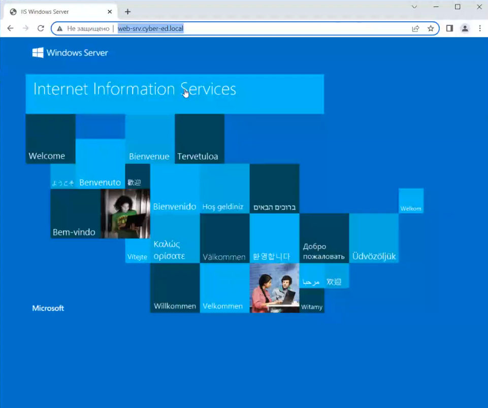

# Speech 6

Мы с вами на прошлом занятии на web-srv поставили IIS.

Но есть один нюанс - чтобы нормально работать с Web-ресурсами, нам понадобится Google Chrome.

Теперь заходим на web-srv:

**http://web-srv.cyber-ed.local**

Сама HTML-страничка содержится по пути **C:\inetpub\wwwroot\iisstart**:

На что можно обратить внимание? Во-первых, подключение не защищено, так как мы используем HTTP:

Можно рассказать про HTTP-запросы (GET, POST, PUT и так далее).

По-хорошему нам необходим перевести наш сайт на HTTPS.

### Далее Костомаха переписывает HTML-страничку, я в этом не вижу смысла, поэтому не конспектировал. Он просто заменил содержимое директории ***C:\inetpub\wwwroot\iisstart*.**

Как конфигурируется HTTPS на IIS? Предварительно нам необходимо запросить сертификат для сервера IIS. Однако сделать это можно в IIS Manager только на самом сервере, не упарвляя им с помощью удаленной консоли через DC1 - у нас не будет вкладки Server Certificates:

Однако мы не сможем открыть эту вкладку и на нашем сервере IIS web-srv.cyber-ed.local, так как у нас установлена Core-версия.

Но мы можем запросить сертификат с помощью Powershell:

Server Manager ⇒ выбираем web-srv ⇒ ПКМ ⇒ Windows Powershell:

Далее вводим команду:

**New-SelfSignedCertificate -DnsName web-srv.cyber-ed.local -CertStoreLocation cert:\LocalMachine\My**

У нас сертификат был импортирован в Personal Certificates на web-srv. Чтобы посмотреть через mmc.exe заходим в Certificates web-srv для Computer account:

Видим наш сертификат:

Теперь его необходимо экспортировать:

Теперь заходим через mmc.exe в Certificates (Local Computer) для DC1, после чего нам необходимо добавить сертификат в доверенные корневые сертификаты в Trusted Root Certification Authorities:

Далее производим импорт сертификата:

Мы добавили наш сертификат в качестве доверенного для DC1.

Теперь переходим обратнов IIS Manager и настраиваем Bindings:

Указываем протокол HTTPS + имя хоста + в качестве SSL-сертификата выбираем импортированный нами сертификат:

Теперь переходим в браузер:

**https://web-srv.cyber-ed.local**

Видим, что подключение у нас защищено.

На самом деле распространять сертификаты в качестве доверенных необходимо с помощью GPO, однако мы это сделали вручную.

**Ссылка как решали проблему с выписыванием сертификата для IIS:**

[How to create a self-signed certificate for IIS using PowerShell - Yaplex](https://www.yaplex.com/how-to-create-a-self-signed-certificate-for-iis-using-powershell/)

### Генерация сертификата с помощью Kali Linux (необязательно):

Команды:

— sudo -i

— cd /tmp

— mkdir certs

— cd certs

— далее необходимо приложение OpenSSL, с помощью которого можно генерировать сертификаты (иначе apt install openssl)

— теперь наша задача сгенерировать самоподписанный корневой сертификат, с помощью которого в дальнейшем будем подписывать дочерние сертификаты

— **openssl genpkey -algorithm RSA -out rootCA.key -pkeyopt rsa_keygen_bits:2048** (генерируем private key)

— cat rootCA.key

— **openssl req -x509 -new -nodes -key rootCA.key -sha256 -days 10950 -out rootCA.crt** (генерируем public key)

— далее вводим всю необходимую информацию для сертификата:

- RU
- Msk
- Msk
- Cyber-ed
- Education
- cyber-ed.local
- email не вводим

— cat rootCA.crt

Теперь, когда мы создали наш private key, мы можем им подписывать наши дочерние сертификаты. То есть теперь мы можем создать закрытый ключ для нашего Web-сайта:

— **openssl genpkey -algorithm RSA -out web-srv.cyber-ed.local.key**

Теперь необходимо создать запрос на выдачу сертификата. Что это? Это определенной документ, который отождествляется с Root-сертификатом, и в нем прописывается - что вот я запрашиваю сертификат и вот параметры моего сертификата:

— **openssl req -new -sha256 -key web-srv.cyber-ed.local.key -subj "/C=RU/ST=Moscow/O=Cyber-ed/CN=web-srv.cyber-ed.local" -reqexts SAN -config <(cat /etc/ssl/openssl.cnf <(printf "\n[SAN]\nsubjectAltName=DNS:web-srv.cyber-ed.local,DNS:www.web-srv.cyber-ed.local")) -out web-srv.cyber-ed.local.csr**

Теперь мы выписываем сам сертификат:

— **openssl x509 -req -in web-srv.cyber-ed.local.csr -CA rootCA.crt -CAkey rootCA.key -CAcreateserial -out web-srv.cyber-ed.local.crt -days 3650 -sha256**

Что мы видим?

Нам нужен **web-srv.cyber-ed.local.crt**, теперь мы можем его скопировать на наш DC1, чтобы далее его перенести на IIS.

### Поехали далее

Предварительно необходимо установить еще один EN Windows Server 2016, который мы сделаем потом еще одним DC (WS16-3-DC3). Запускаем его. Также нам еще потребуется DC4 (WS16-3-DC4).

Однако предварительно нам необходимо переконфигурировать наш **Mikrotik**.

Предварительно идем в настройки Сети Микротика (должен быть выключен) в Virtual Box и изменяем в сеть:

1. в Adapter 3 в Attached to: выбираем Internal Network (Внутрення сеть);
2. в Name прописываем intnet2:

1. далее переходим в Адаптер 4 ⇒ включаем его;
2. в Attached to: выбираем Internal Network (Внутрення сеть);
3. в Name прописываем intnet3:

Таким обазом мы включили интерфейсы, которые будут коннектиться к другим Windows-серверам, имулируя разношерстную сеть.

У DC3 будет intnet2, а у DC4 будет intnet3 в настройках адаптера.

### Если не получается подключиться к Winbox, то на Микротик можно зайти через [http://192.168.10.254/webfig/](http://192.168.10.254/webfig/) на виртуалке:

Мы видим, что у нас появились новые адаптеры:

- ether5
- ether7

Нам нужно определить что это за интерфейсы, для этого нам необходимо найти MAC-адреса. Нажимаем на интерфейс и пролистываем вниз к MAC Address:

Или так:

Теперь идем в настройки сетевых адаптеров Микротика в Virtual Box и в Advanced находим MAC-адреса Adapter 3 и Adapter 4:

В итоге ether5 и ether7 переименовываем исходя из того, какая это сеть: intnet2 или intnet3.

Получится вот так:

Теперь необходимо настроить IP-адресацию. Для этого переходим в **Addresses (или IP ⇒ Addresses в Winbox)** и настраиваем адресацию на интерфейсах intnet2 и intnet3:

На этом все настройки Микротика завершены.

Теперь запускаем DC1 и DC3. Переходим на DC1.

На нем в Server Manager в Tools открыть Active Directory Sites and Services:

Я напомню, что у DC есть определенный набор ролей, а также набор сервисов, с помощью которых с DC взаимодействуют различные объекты домена.

**И вот придумали функционал Sites.**

### Рисую:

У нас есть DC, к которому обращаются с большим количеством различных целей:

- аутентификация
- GPO
- DNS-резолвинг
- IP-адресация
- и многое другое

Для отказоустойчивости мы создаем 2 Котроллер Домена (DC2). И оба они образуют пространство имен (в нашем случае) - cyber-ed.local.

Пространство имен в контексте домена работает так, что запрос осуществляется не конкретно на DC1 или DC2, а обращение идет по DNS-имени cyber-ed.local с указанием какого-то сервиса, к которому клиенту необходимо обратиться. Например:

**cyber-ed.local:kerberos**

где kerberos - это SRV-запись DNS. То есть kerberos осуществляет резолв сервиса.

Однако резолв сервиса осуществляется по домену cyber-ed.local.

И вот в нашем случае, если DC1 работает в полную мощность, то ответит скорее всего он на запрос **cyber-ed.local:kerberos**. Однако если DC1 (с IP-адресом 192.168.10.200) будет сломан, то ответит DC2 (с IP-адресом 192.168.10.201).

Однако предположим, что в нашей инфраструктуре появился DC3. Схема сохраняется, пространство имен то же.

Но есть один нюанс - что, например, DC1 и DC2 расположены в Москве, а DC3 в Екатеринбурге. Где мы, например, для откзоустойчивости и репликации с DC3 еще и DC9 поставили.

И нюанс заключается в том, что эти две площадки разделены территориально, но при это для связи между площадками мы пользуемся VPN-туннелем, который выделяет нам Интернет-провайдер.

Но помним, что у нас есть БД объектов ntds.dit, которая должна реплицироваться между DC1, DC2, DC3 и DC9.

И синхронизация между DC производится мгновенно при внесении изменений на любом из DC. Из-за чего может забиваться VPN-туннель между площадками - так как может быть много запросов на синхронизацию.

Также, как вы помните, есть Глобальный Каталог (GC), который содержит в себе набор минимальных свойств объектов для быстрого поиска. Он, как правило, сильно помогает, когда доменов несколько.

Но когда домен один, то на наш запрос может ответить DC9 из совершенно другого офиса, из-за чего также страдает канал связи по VPN между площадками.

И вот вся эта подводка была для того, чтобы сказать, что **функционал Sites** используется как раз для того, чтобы разделить описанное выше территориальное взаимодействие.

— то есть мы говорим, что вся техника на площадке в Екатеринбурге - это **ЕКБ Site**, а в Москве - это **МСК Site**.

Разделив по Сайтам объекты, явным образом даем понять инфраструктуре, как вести синхронизацию запросов. Поэтому, например, PC1 из Москвы сначала пойдет к DC1 и DC2 из своего Сайта и будет их ждать. И только после длительного Time out’а пойдет на другой Сайт (например, на наш ЕКБ).

И вот наша задача сейчас создать Сайты. У нас будет 2 сайта, и мы к ним прилинкуем IP-сети.

Сайты работают относительно сетей.

Теперь перейдем в Default-First-Site-Name ⇒ ПКМ ⇒ Rename ⇒ Main-office (Сайт нашего главного офиса).

Далее по Sites ⇒ ПКМ ⇒ New Site…:

Назовем его New-office:

Однако у нас нет специально выделенных сетей в Subnets:

Создаем IP-сеть. Subnets ⇒ ПКМ ⇒ New Subnet…:

Теперь пишем первую сеть:

- Prefix ⇒ 192.168.10.0/24
- Site Name ⇒ Main-office

Далее пишем вторую сеть:

- Prefix ⇒ 192.168.20/24
- Site Name ⇒ New-office

Видим:

На этом конфигурация Сайтов закончена. Кстати синхронизация DC по умолчанию в разных сайтах происходит раз в 3 часа.

### Теперь переходим на DC3. Нам необходимо сделать его Котроллером Домена (так как сейчас это голый сервер) + настроить DNS.

Сделаем преднастройку:

Server Manager ⇒ Local Server ⇒ Ethernet:

Далее прописываем IP-адрес и выключаем IPv6:

Теперь изменим часовой пояс:

И имя компьютера (**dc3**):

Далее перезагружаемся.

Теперь установим роли и компоненты (как на первых занятиях, но с одним нюансом).

Остальное пропускаем. Далее устанавливаем.

После установки повышаем сервер до Domain Controller:

В Domain указываю cyber-ed.local:

Next ⇒ в Site Name выбираем наш второй Сайт New-office + задаем DSRM-пароль (пароль восстановления DC):

Далее Next ⇒ Next ⇒ выбираем с какого DC реплицироваться (выбираем любой или any):

Далее Next ⇒ Next ⇒ Close:

Если DC2 выключен, то будет ошибка с репликацией:

Ее можно на DC1 в CMD посмотреть с помощью **repadmin.exe /showrepl**:

Была неудачная репликация с DC2, так как он выключен.

### Теперь наша задача будет создать еще один DC (DC4) с другим доменом и другим лесом.

То есть суть в том, чтобы показать, как настроить доверие между доменами различных лесов.

### Рисую:

У нас есть cyber-ed.local - это один лес + у него есть огромная БД AD, в которой содержатся объекты и их свойства:

- учетные записи
- компьютеры
- принтеры
- группы
- сетевые папки
- можем создавать свои собственные объекты
- и многое другое

Однако есть еще один домен, у которого есть своя БД AD со своими объектами.

Но есть один нюанс - эти 2 домена могут отличаться настолько сильно, что они будут понимать кто есть кто.

То есть мы не можем просто взять и одного пользователя переместить в другой домен.

Все потому что есть Схема Active Directory. Что это значит?

— вот в AD есть объект-пользователь

— у объекта есть свойства (например, его имя, фамилия и так далее). То есть все это атрибут пользователя

— вы можете создать новое свойство - например, добавить email или номер телефона

— только часть свойств будут по-умолчанию (типа имени и фамилии), а другая часть будет кастомными (например, возраст, номер телефона и так далее)

— и вот эти кастомные свойства будут знать и отличать только домен, в AD которого эти объекты будут располагаться

— поэтому этого пользователя с кастомными свойствами вы в другой домен перенести не сможете

Однако между доменами можно настраивать взаимодействие.

Например, пользователь из одного домена решил прийти на файловый ресурс другого домена. Что тогда делать?

Когда мы говорили с вами про файловые шары, мы также затрагивали права DFS, к какой шаре кто и с какими привилегиями могут подключаться.

Но также есть права **NTFS (NT File System)**. То есть NTFS - это файловая система, которая отвечает за то, чтобы представить данные на диске в человекочитаемом виде не только для пользователей, но и для ОС, другая задача - структурировать данные.

То есть файловая система представляет ваши данные на диске, позволяет к ним обратиться, считать, переместить и так далее. Но также она назначает права безопасности.

У NTFS есть довольно много прав безопасности:

[https://winnote.ru/security/93-razresheniya-ntfs.html#:~:text=Под разрешением NTFS понимается правило,(под его учетной записью](https://winnote.ru/security/93-razresheniya-ntfs.html#:~:text=%D0%9F%D0%BE%D0%B4%20%D1%80%D0%B0%D0%B7%D1%80%D0%B5%D1%88%D0%B5%D0%BD%D0%B8%D0%B5%D0%BC%20NTFS%20%D0%BF%D0%BE%D0%BD%D0%B8%D0%BC%D0%B0%D0%B5%D1%82%D1%81%D1%8F%20%D0%BF%D1%80%D0%B0%D0%B2%D0%B8%D0%BB%D0%BE,(%D0%BF%D0%BE%D0%B4%20%D0%B5%D0%B3%D0%BE%20%D1%83%D1%87%D0%B5%D1%82%D0%BD%D0%BE%D0%B9%20%D0%B7%D0%B0%D0%BF%D0%B8%D1%81%D1%8C%D1%8E)).

**По ссылке есть табличка с разрешениями NTFS.**

Там указаны базовые разрешения:

- чтение
- запись
- список содержимого папки
- чтение и выполнение
- изменение
- полный доступ
- особые разрешения:
    - обзор папок / выполнение файлов
    - содержание папки / чтение данных
    - чтение атрибутов
    - чтение дополнительных атрибутов
    - создание файлов / запись данных
    - создание папко / дозапись данных
    - запись атрибутов
    - запись дополенительных атрибутов
    - удаление
    - чтение разрешений
    - смена разрешений
    - смена владельца
    - синхронизация

И теперь возвращаемся к тому, с чего мы начали:

— у NTFS есть свои разрешения

— и у Файлового ресурса тоже есть свои права

Покажу чем одно отличается от другого (сначала **Share**):

**NTFS.**

ПКМ по любому файлу ⇒ Properties ⇒ Security:

### И вот теперь возвращаемся к Трастам.

Когда мы из одного домена хотим перейти в другой, и нам нужно добраться до файлового ресурса, то по-хорошему нам понадобится УЗ из нашего домена.

Однако ведь наши домены никак не связаны вместе.

У нас есть следующий функционал:

- групп
- доверия

Мы можем между 2-я домена сделать доверительные отношения с другим доменом и определим доступы объектов другого домена до наших ресурсов, жестко их ограничив.

Теперь любой пользователь из другого домена, который к нам бы не приходил, у него будут жесткие ограничения, которые мы можем регулировать.

И вот собственно доверия между доменами и заключается в том, что мы подружились с доменами и можем производить взаимные аутентификации друг у друга.

**Какое бывает доверие:**

- транзитивное - когда мы дружим обоюдно, из домена в домен
- не транзитивное - одностороннее, когда только один имеет права в другом

### Теперь сделаем доверительные отношения между 2-я доменами

Для этого создадим домен на DC4.

Сделаем преднастройку:

Server Manager ⇒ Local Server ⇒ Ethernet:

Далее прописываем IP-адрес (без DNS) и выключаем IPv6:

Теперь изменим часовой пояс:

И имя компьютера (**dc4**):

Далее перезагружаемся.

Теперь установим роли и компоненты (как на первых занятиях).

Остальное пропускаем. Далее устанавливаем.

После установки повышаем сервер до Domain Controller:

Выбираю **Add a new forest** ⇒ прописываю домен **hack.local**:

Next ⇒ задаем DSRM-пароль (пароль восстановления DC):

Далее Next ⇒ Next ⇒ Next ⇒ Next ⇒ Close:

Далее перезагружаемся.

Теперь нам нужно подружить 2 домена через DNS.

**********************************************************************Сейчас заходим на первый Контроллер Домена (DC1):**********************************************************************

Далее Server Manager ⇒ Tools ⇒ DNS:

ПКМ по вкладке Conditional Forwarders ⇒ New Conditional Forwarder…:

Здесь мы говорим, что есть какой-то домен и за него отвечает конкретный сервер с конкретным IP-адресом.

То есть тут указываем домен **hack.local**, о котором cyber-ed.local не знает, а также его IP-**адрес 10.10.30.204**:

### Ошибка на скриншоте вызвана тем, что DC4 на тот момент еще не запустился, поэтому резолв не произошел, можно просто нажать OK.

**Аналогично эти действия нужно произвести на DC4:**

Прописываем имя домена **cyber-ed.local** и IP-адрес **192.168.10.200**:

### Тут тоже почему-то у Костомахи не зарезолвилось, можно просто нажать OK. Сетевая связанность между DC1 и DC4 была:

### Теперь давайте на DC1 настроим доверие:

Для этого в Server Manager ⇒ Tools ⇒ Active Directory Domain and Trusts:

ПКМ по домену cyber-ed.local ⇒ Properties:

В Trusts ⇒ New Trust…:

Далее Next ⇒ задаем название доверию между доменами (**hack.local**):

Теперь выбираем тип доверия ⇒ Forest trust (так как доверие на уровне двух лесов доменов):

Далее указываем транзитивность (Two-way):

Теперь создаем само доверие между доменами:

- The domain only - доверие настраивается только для одного домена. Для второго впоследствии будет создавать так же вручную
- Both this domain and the specified domain - удаленно настраивается и для второго домена

Далее указываем УЗ домена hack.local:

Указываем процесс аутентификации:

- Forest-wide authentication - прямая аутентификация, когда одни объекты имеют права для доступа к другим объектам в другом объекте
- Selective authentication - вручную указывается кто к чему имеет доступ

Видим такое же окно - оно со стороны другого домена, выбираем то же самое:

Далее Next ⇒ выбираем No (так как мы это уже настроили на другом сервере):

Next ⇒ Finish.

Доверие у нас появилось. **Причем и на DC4**:

### Теперь запустим Windows 10:

Windows 10 у нас в домене, мы можем залогиниться под доменной УЗ cyber-ed.local:

Но давайте попробуем авторизоваться на Windows 10 с доменной УЗ hack.local.

Предварительно создадим УЗ на **DC4**:

Теперь давайте под УЗ user@hack.local авторизоваться на Windows 10, которая в домене cyber-ed.local:

И у нас все получилось:

